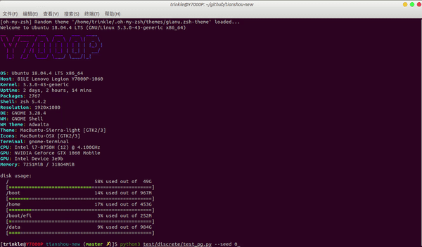

<div align="center">
  <a href="http://tianshou.readthedocs.io"></a>
</div>

---

[](https://pypi.org/project/tianshou/)
[](https://github.com/thu-ml/tianshou/actions)
[](https://codecov.io/gh/thu-ml/tianshou)
[](https://tianshou.readthedocs.io)
[](https://github.com/thu-ml/tianshou/issues)
[](https://github.com/thu-ml/tianshou/stargazers)
[](https://github.com/thu-ml/tianshou/network)
[](https://github.com/thu-ml/tianshou/blob/master/LICENSE)
[](https://gitter.im/thu-ml/tianshou?utm_source=badge&utm_medium=badge&utm_campaign=pr-badge&utm_content=badge)

**Tianshou** ([天授](https://baike.baidu.com/item/%E5%A4%A9%E6%8E%88)) is a reinforcement learning platform based on pure PyTorch. Unlike existing reinforcement learning libraries, which are mainly based on TensorFlow, have many nested classes, unfriendly API, or slow-speed, Tianshou provides a fast-speed framework and pythonic API for building the deep reinforcement learning agent with the least number of lines of code. The supported interface algorithms currently include:


- [Policy Gradient (PG)](https://papers.nips.cc/paper/1713-policy-gradient-methods-for-reinforcement-learning-with-function-approximation.pdf)
- [Deep Q-Network (DQN)](https://storage.googleapis.com/deepmind-media/dqn/DQNNaturePaper.pdf)
- [Double DQN (DDQN)](https://arxiv.org/pdf/1509.06461.pdf) with n-step returns
- [Advantage Actor-Critic (A2C)](https://openai.com/blog/baselines-acktr-a2c/)
- [Deep Deterministic Policy Gradient (DDPG)](https://arxiv.org/pdf/1509.02971.pdf)
- [Proximal Policy Optimization (PPO)](https://arxiv.org/pdf/1707.06347.pdf)
- [Twin Delayed DDPG (TD3)](https://arxiv.org/pdf/1802.09477.pdf)
- [Soft Actor-Critic (SAC)](https://arxiv.org/pdf/1812.05905.pdf)
- Vanilla Imitation Learning

Tianshou supports parallel workers for all algorithms as well. All of these algorithms are reformatted as replay-buffer based algorithms. Our team is working on supporting more algorithms and more scenarios on Tianshou in this period of development.

In Chinese, Tianshou means the innate talent, not taught by others. Tianshou is a reinforcement learning platform. As we know, an RL agent does not learn from humans, so taking "Tianshou" means that there is no teacher to study with, but to learn by interacting with an environment.

“天授”意指上天所授，引申为与生具有的天赋。天授是强化学习平台，而强化学习算法并不是向人类学习的，所以取“天授”意思是没有老师来教，而是自己通过跟环境不断交互来进行学习。

## Installation

Tianshou is currently hosted on [PyPI](https://pypi.org/project/tianshou/). It requires Python >= 3.6. You can simply install Tianshou with the following command:

```bash
pip3 install tianshou -U
```

You can also install with the newest version through GitHub:

```bash
pip3 install git+https://github.com/thu-ml/tianshou.git@master
```

After installation, open your python console and type

```python
import tianshou as ts
print(ts.__version__)
```

If no error occurs, you have successfully installed Tianshou.

## Documentation

The tutorials and API documentation are hosted on [tianshou.readthedocs.io](https://tianshou.readthedocs.io/).

The example scripts are under [test/](https://github.com/thu-ml/tianshou/blob/master/test) folder and [examples/](https://github.com/thu-ml/tianshou/blob/master/examples) folder. It may fail to run with PyPI installation, so please re-install the github version through `pip3 install git+https://github.com/thu-ml/tianshou.git@master`.

<!-- 这里有一份天授平台简短的中文简介：https://www.zhihu.com/question/377263715 -->

## Why Tianshou?

### Fast-speed

Tianshou is a lightweight but high-speed reinforcement learning platform. For example, here is a test on a laptop (i7-8750H + GTX1060). It only uses 3 seconds for training an agent based on vanilla policy gradient on the CartPole-v0 task: (seed may be different across different platform and device)

```bash
python3 test/discrete/test_pg.py --seed 0 --render 0.03
```

<div align="center">
  </a>
</div>

We select some of famous reinforcement learning platforms: 2 GitHub repos with most stars in all RL platforms (OpenAI Baseline and RLlib) and 2 GitHub repos with most stars in PyTorch RL platforms (PyTorch DRL and rlpyt). Here is the benchmark result for other algorithms and platforms on toy scenarios: (tested on the same laptop as mentioned above)

| RL Platform     | [Tianshou](https://github.com/thu-ml/tianshou)               | [Baselines](https://github.com/openai/baselines)             | [Ray/RLlib](https://github.com/ray-project/ray/tree/master/rllib/) | [PyTorch DRL](https://github.com/p-christ/Deep-Reinforcement-Learning-Algorithms-with-PyTorch) | [rlpyt](https://github.com/astooke/rlpyt)                    |
| --------------- | ------------------------------------------------------------ | ------------------------------------------------------------ | ------------------------------------------------------------ | ------------------------------------------------------------ | ------------------------------------------------------------ |
| GitHub Stars    | [](https://github.com/thu-ml/tianshou/stargazers) | [](https://github.com/openai/baselines/stargazers) | [](https://github.com/ray-project/ray/stargazers) | [](https://github.com/p-christ/Deep-Reinforcement-Learning-Algorithms-with-PyTorch/stargazers) | [](https://github.com/astooke/rlpyt/stargazers) |
| Algo - Task     | PyTorch                                                      | TensorFlow                                                   | TF/PyTorch                                                   | PyTorch                                                      | PyTorch                                                      |
| PG - CartPole   | 9.03±4.18s                                                   | None                                                         | 15.77±6.28s                                                  | None                                                         | ?                                                            |
| DQN - CartPole  | 10.61±5.51s                                                  | 1046.34±291.27s                                              | 40.16±12.79s                                                 | 175.55±53.81s                                                | ?                                                            |
| A2C - CartPole  | 11.72±3.85s                                                  | *(~1612s)                                                    | 46.15±6.64s                                                  | Runtime Error                                                | ?                                                            |
| PPO - CartPole  | 35.25±16.47s                                                 | *(~1179s)                                                    | 62.21±13.31s (APPO)                                          | 29.16±15.46s                                                 | ?                                                            |
| DDPG - Pendulum | 46.95±24.31s                                                 | *(>1h)                                                       | 377.99±13.79s                                                | 652.83±471.28s                                               | 172.18±62.48s                                                |
| TD3 - Pendulum  | 48.39±7.22s                                                  | None                                                         | 620.83±248.43s                                               | 619.33±324.97s                                               | 210.31±76.30s                                                |
| SAC - Pendulum  | 38.92±2.09s                                                  | None                                                         | 92.68±4.48s                                                  | 808.21±405.70s                                               | 295.92±140.85s                                               |

*\*: Could not reach the target reward threshold in 1e6 steps in any of 10 runs. The total runtime is in the brackets.*

*?: We have tried but it is nontrivial for running non-Atari game on rlpyt. See [here](https://github.com/astooke/rlpyt/issues/135).*

All of the platforms use 10 different seeds for testing. We erase those trials which failed for training. The reward threshold is 195.0 in CartPole and -250.0 in Pendulum over consecutive 100 episodes' mean returns. 

Tianshou and RLlib's configures are very similar. They both use multiple workers for sampling. Indeed, both RLlib and rlpyt are excellent reinforcement learning platform.

We will add results of Atari Pong / Mujoco these days.

### Reproducible

Tianshou has its unit tests. Different from other platforms, **the unit tests include the full agent training procedure for all of the implemented algorithms**. It would be failed once if it could not train an agent to perform well enough on limited epochs on toy scenarios. The unit tests secure the reproducibility of our platform. 

Check out the [GitHub Actions](https://github.com/thu-ml/tianshou/actions) page for more detail.

### Modularized Policy

We decouple all of the algorithms into 4 parts:

- `__init__`: initialize the policy;
- `forward`: to compute actions over given observations;
- `process_fn`: to preprocess data from replay buffer (since we have reformulated all algorithms to replay-buffer based algorithms);
- `learn`: to learn from a given batch data.

Within these API, we can interact with different policies conveniently.

### Elegant and Flexible

Currently, the overall code of Tianshou platform is less than 1500 lines without environment wrappers for Atari and Mujoco. Most of the implemented algorithms are less than 100 lines of python code. It is quite easy to go through the framework and understand how it works. We provide many flexible API as you wish, for instance, if you want to use your policy to interact with the environment with (at least) `n` steps:

```python
result = collector.collect(n_step=n)
```

If you have 3 environments in total and want to collect 1 episode in the first environment, 3 for the third environment:

```python
result = collector.collect(n_episode=[1, 0, 3])
```

If you want to train the given policy with a sampled batch:

```python
result = policy.learn(collector.sample(batch_size))
```

You can check out the [documentation](https://tianshou.readthedocs.io) for further usage.

## Quick Start

This is an example of Deep Q Network. You can also run the full script at [test/discrete/test_dqn.py](https://github.com/thu-ml/tianshou/blob/master/test/discrete/test_dqn.py).

First, import some relevant packages:

```python
import gym, torch, numpy as np, torch.nn as nn
from torch.utils.tensorboard import SummaryWriter
import tianshou as ts
```

Define some hyper-parameters:

```python
task = 'CartPole-v0'
lr = 1e-3
gamma = 0.9
n_step = 3
eps_train, eps_test = 0.1, 0.05
epoch = 10
step_per_epoch = 1000
collect_per_step = 10
target_freq = 320
batch_size = 64
train_num, test_num = 8, 100
buffer_size = 20000
writer = SummaryWriter('log/dqn')  # tensorboard is also supported!
```

Make environments:

```python
# you can also try with SubprocVectorEnv
train_envs = ts.env.VectorEnv([lambda: gym.make(task) for _ in range(train_num)])
test_envs = ts.env.VectorEnv([lambda: gym.make(task) for _ in range(test_num)])
```

Define the network:

```python
class Net(nn.Module):
    def __init__(self, state_shape, action_shape):
        super().__init__()
        self.model = nn.Sequential(*[
            nn.Linear(np.prod(state_shape), 128), nn.ReLU(inplace=True),
            nn.Linear(128, 128), nn.ReLU(inplace=True),
            nn.Linear(128, 128), nn.ReLU(inplace=True),
            nn.Linear(128, np.prod(action_shape))
        ])
    def forward(self, s, state=None, info={}):
        if not isinstance(s, torch.Tensor):
            s = torch.tensor(s, dtype=torch.float)
        batch = s.shape[0]
        logits = self.model(s.view(batch, -1))
        return logits, state

env = gym.make(task)
state_shape = env.observation_space.shape or env.observation_space.n
action_shape = env.action_space.shape or env.action_space.n
net = Net(state_shape, action_shape)
optim = torch.optim.Adam(net.parameters(), lr=lr)
```

Setup policy and collectors:

```python
policy = ts.policy.DQNPolicy(net, optim, gamma, n_step,
    use_target_network=True, target_update_freq=target_freq)
train_collector = ts.data.Collector(policy, train_envs, ts.data.ReplayBuffer(buffer_size))
test_collector = ts.data.Collector(policy, test_envs)
```

Let's train it:

```python
result = ts.trainer.offpolicy_trainer(
    policy, train_collector, test_collector, epoch, step_per_epoch, collect_per_step,
    test_num, batch_size, train_fn=lambda e: policy.set_eps(eps_train),
    test_fn=lambda e: policy.set_eps(eps_test),
    stop_fn=lambda x: x >= env.spec.reward_threshold, writer=writer, task=task)
print(f'Finished training! Use {result["duration"]}')
```

Save / load the trained policy (it's exactly the same as PyTorch nn.module):

```python
torch.save(policy.state_dict(), 'dqn.pth')
policy.load_state_dict(torch.load('dqn.pth'))
```

Watch the performance with 35 FPS:

```python
collector = ts.data.Collector(policy, env)
collector.collect(n_episode=1, render=1 / 35)
collector.close()
```

Look at the result saved in tensorboard: (on bash script)

```bash
tensorboard --logdir log/dqn
```

You can check out the [documentation](https://tianshou.readthedocs.io) for advanced usage.

## Contributing

Tianshou is still under development. More algorithms and features are going to be added and we always welcome contributions to help make Tianshou better. If you would like to contribute, please check out [docs/contributing.rst](https://github.com/thu-ml/tianshou/blob/master/docs/contributing.rst).

## TODO

Check out the [Issue/PR Categories](https://github.com/thu-ml/tianshou/projects/2) and [Support Status](https://github.com/thu-ml/tianshou/projects/3) page for more detail.

## Citing Tianshou

If you find Tianshou useful, please cite it in your publications.

```latex
@misc{tianshou,
  author = {Jiayi Weng, Minghao Zhang, Dong Yan, Hang Su, Jun Zhu},
  title = {Tianshou},
  year = {2020},
  publisher = {GitHub},
  journal = {GitHub repository},
  howpublished = {\url{https://github.com/thu-ml/tianshou}},
}
```

## Acknowledgment

Tianshou was previously a reinforcement learning platform based on TensorFlow. You can check out the branch [`priv`](https://github.com/thu-ml/tianshou/tree/priv) for more detail. Many thanks to [Haosheng Zou](https://github.com/HaoshengZou)'s pioneering work for Tianshou before version 0.1.1.

We would like to thank [TSAIL](http://ml.cs.tsinghua.edu.cn/) and [Institute for Artificial Intelligence, Tsinghua University](http://ai.tsinghua.edu.cn/) for providing such an excellent AI research platform.
