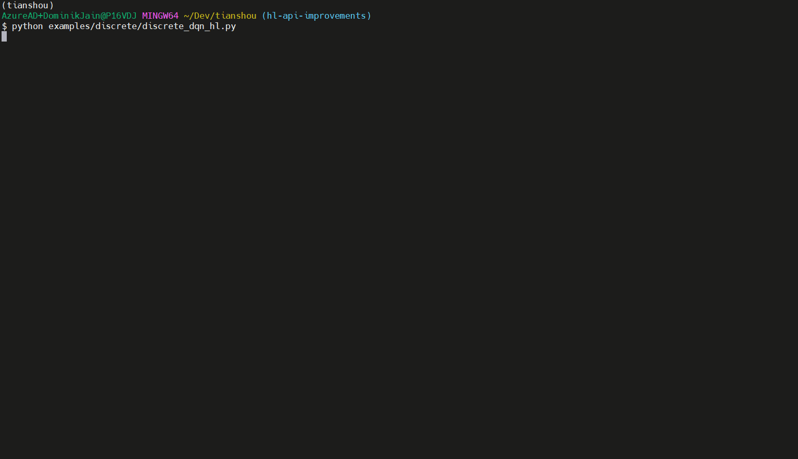

<div align="center">
  <a href="http://tianshou.readthedocs.io"></a>
</div>

---

[](https://pypi.org/project/tianshou/) [](https://github.com/conda-forge/tianshou-feedstock) [](https://tianshou.org/en/master/) [](https://github.com/thu-ml/tianshou/actions) [](https://codecov.io/gh/thu-ml/tianshou) [](https://github.com/thu-ml/tianshou/issues) [](https://github.com/thu-ml/tianshou/stargazers) [](https://github.com/thu-ml/tianshou/network) [](https://github.com/thu-ml/tianshou/blob/master/LICENSE)

> [!NOTE]
> **Tianshou version 2 is here!**  
> 
> We have released the new major version of Tianshou on PyPI.  
> Version 2 is a complete overhaul of the software design of the procedural API, in which
>   * we establish a clear separation between learning algorithms and policies (via the separate abstractions `Algorithm` and `Policy`).
>   * we provide more well-defined, more usable interfaces with extensive documentation of all algorithm and trainer parameters,
>     renaming some parameters to make their names more consistent and intuitive.
>   * the class hierarchy is fully revised, establishing a clear separation between on-policy, off-policy and offline algorithms
>     at the type level and ensuring that all inheritance relationships are meaningful.
> 
> Because of the extent of the changes, this version is not backwards compatible with previous versions of Tianshou.
> For migration information, please see the [change log](CHANGELOG.md). 

**Tianshou** ([天授](https://baike.baidu.com/item/%E5%A4%A9%E6%8E%88)) is a reinforcement learning (RL) library based on pure PyTorch and [Gymnasium](http://github.com/Farama-Foundation/Gymnasium). Tianshou's main features at a glance are:

1. Modular low-level interfaces for algorithm developers (RL researchers) that are both flexible, hackable and type-safe.
1. Convenient high-level interfaces for applications of RL (training an implemented algorithm on a custom environment).
1. Large scope: online (on- and off-policy) and offline RL, experimental support for multi-agent RL (MARL), experimental support for model-based RL, and more

Unlike other reinforcement learning libraries, which may have complex codebases,
unfriendly high-level APIs, or are not optimized for speed, Tianshou provides a high-performance, modularized framework
and user-friendly interfaces for building deep reinforcement learning agents. One more aspect that sets Tianshou apart is its
generality: it supports online and offline RL, multi-agent RL, and model-based algorithms.

Tianshou aims at enabling concise implementations, both for researchers and practitioners, without sacrificing flexibility.

Supported algorithms include:

- [Deep Q-Network (DQN)](https://storage.googleapis.com/deepmind-media/dqn/DQNNaturePaper.pdf)
- [Double DQN](https://arxiv.org/pdf/1509.06461.pdf)
- [Dueling DQN](https://arxiv.org/pdf/1511.06581.pdf)
- [Branching DQN](https://arxiv.org/pdf/1711.08946.pdf)
- [Categorical DQN (C51)](https://arxiv.org/pdf/1707.06887.pdf)
- [Rainbow DQN (Rainbow)](https://arxiv.org/pdf/1710.02298.pdf)
- [Quantile Regression DQN (QRDQN)](https://arxiv.org/pdf/1710.10044.pdf)
- [Implicit Quantile Network (IQN)](https://arxiv.org/pdf/1806.06923.pdf)
- [Fully-parameterized Quantile Function (FQF)](https://arxiv.org/pdf/1911.02140.pdf)
- [Policy Gradient (PG)](https://papers.nips.cc/paper/1713-policy-gradient-methods-for-reinforcement-learning-with-function-approximation.pdf)
- [Natural Policy Gradient (NPG)](https://proceedings.neurips.cc/paper/2001/file/4b86abe48d358ecf194c56c69108433e-Paper.pdf)
- [Advantage Actor-Critic (A2C)](https://openai.com/blog/baselines-acktr-a2c/)
- [Trust Region Policy Optimization (TRPO)](https://arxiv.org/pdf/1502.05477.pdf)
- [Proximal Policy Optimization (PPO)](https://arxiv.org/pdf/1707.06347.pdf)
- [Deep Deterministic Policy Gradient (DDPG)](https://arxiv.org/pdf/1509.02971.pdf)
- [Twin Delayed DDPG (TD3)](https://arxiv.org/pdf/1802.09477.pdf)
- [Soft Actor-Critic (SAC)](https://arxiv.org/pdf/1812.05905.pdf)
- [Randomized Ensembled Double Q-Learning (REDQ)](https://arxiv.org/pdf/2101.05982.pdf)
- [Discrete Soft Actor-Critic (SAC-Discrete)](https://arxiv.org/pdf/1910.07207.pdf)
- [Vanilla Imitation Learning](https://en.wikipedia.org/wiki/Apprenticeship_learning)
- [Batch-Constrained deep Q-Learning (BCQ)](https://arxiv.org/pdf/1812.02900.pdf)
- [Conservative Q-Learning (CQL)](https://arxiv.org/pdf/2006.04779.pdf)
- [Twin Delayed DDPG with Behavior Cloning (TD3+BC)](https://arxiv.org/pdf/2106.06860.pdf)
- [Discrete Batch-Constrained deep Q-Learning (BCQ-Discrete)](https://arxiv.org/pdf/1910.01708.pdf)
- [Discrete Conservative Q-Learning (CQL-Discrete)](https://arxiv.org/pdf/2006.04779.pdf)
- [Discrete Critic Regularized Regression (CRR-Discrete)](https://arxiv.org/pdf/2006.15134.pdf)
- [Generative Adversarial Imitation Learning (GAIL)](https://arxiv.org/pdf/1606.03476.pdf)
- [Prioritized Experience Replay (PER)](https://arxiv.org/pdf/1511.05952.pdf)
- [Generalized Advantage Estimator (GAE)](https://arxiv.org/pdf/1506.02438.pdf)
- [Posterior Sampling Reinforcement Learning (PSRL)](https://www.ece.uvic.ca/~bctill/papers/learning/Strens_2000.pdf)
- [Intrinsic Curiosity Module (ICM)](https://arxiv.org/pdf/1705.05363.pdf)
- [Hindsight Experience Replay (HER)](https://arxiv.org/pdf/1707.01495.pdf)

Other noteworthy features:

- Elegant framework with dual APIs:
  - Tianshou's high-level API maximizes ease of use for application development while still retaining a high degree
    of flexibility.
  - The fundamental procedural API provides a maximum of flexibility for algorithm development without being
    overly verbose.
- State-of-the-art results in [MuJoCo benchmarks](https://github.com/thu-ml/tianshou/tree/master/examples/mujoco) for REINFORCE/A2C/TRPO/PPO/DDPG/TD3/SAC algorithms
- Support for vectorized environments (synchronous or asynchronous) for all algorithms (see [usage](https://tianshou.readthedocs.io/en/master/01_tutorials/07_cheatsheet.html#parallel-sampling))
- Support for super-fast vectorized environments based on [EnvPool](https://github.com/sail-sg/envpool/) for all algorithms (see [usage](https://tianshou.readthedocs.io/en/master/01_tutorials/07_cheatsheet.html#envpool-integration))
- Support for recurrent state representations in actor networks and critic networks (RNN-style training for POMDPs) (see [usage](https://tianshou.readthedocs.io/en/master/01_tutorials/07_cheatsheet.html#rnn-style-training))
- Support any type of environment state/action (e.g. a dict, a self-defined class, ...) [Usage](https://tianshou.readthedocs.io/en/master/01_tutorials/07_cheatsheet.html#user-defined-environment-and-different-state-representation)
- Support for customized training processes (see [usage](https://tianshou.readthedocs.io/en/master/01_tutorials/07_cheatsheet.html#customize-training-process))
- Support n-step returns estimation and prioritized experience replay for all Q-learning based algorithms; GAE, nstep and PER are highly optimized thanks to numba's just-in-time compilation and vectorized numpy operations
- Support for multi-agent RL (see [usage](https://tianshou.readthedocs.io/en/master/01_tutorials/07_cheatsheet.html#multi-agent-reinforcement-learning))
- Support for logging based on both [TensorBoard](https://www.tensorflow.org/tensorboard) and [W&B](https://wandb.ai/)
- Support for multi-GPU training (see [usage](https://tianshou.readthedocs.io/en/master/01_tutorials/07_cheatsheet.html#multi-gpu))
- Comprehensive documentation, PEP8 code-style checking, type checking and thorough [tests](https://github.com/thu-ml/tianshou/actions)

In Chinese, Tianshou means divinely ordained, being derived to the gift of being born.
Tianshou is a reinforcement learning platform, and the nature of RL is not learn from humans.
So taking "Tianshou" means that there is no teacher to learn from, but rather to learn by oneself through constant interaction with the environment.

“天授”意指上天所授，引申为与生具有的天赋。天授是强化学习平台，而强化学习算法并不是向人类学习的，所以取“天授”意思是没有老师来教，而是自己通过跟环境不断交互来进行学习。

## Installation

Tianshou is currently hosted on [PyPI](https://pypi.org/project/tianshou/) and [conda-forge](https://github.com/conda-forge/tianshou-feedstock). It requires Python >= 3.11.

For installing the most recent version of Tianshou, the best way is clone the repository and install it with [poetry](https://python-poetry.org/)
(which you need to install on your system first)

```bash
git clone git@github.com:thu-ml/tianshou.git
cd tianshou
poetry install
```

You can also install the dev requirements by adding `--with dev` or the extras
for say mujoco and acceleration by [envpool](https://github.com/sail-sg/envpool)
by adding `--extras "mujoco envpool"`

If you wish to install multiple extras, ensure that you include them in a single command. Sequential calls to `poetry install --extras xxx` will overwrite prior installations, leaving only the last specified extras installed.
Or you may install all the following extras by adding `--all-extras`.

Available extras are:

- `atari` (for Atari environments)
- `box2d` (for Box2D environments)
- `classic_control` (for classic control (discrete) environments)
- `mujoco` (for MuJoCo environments)
- `mujoco-py` (for legacy mujoco-py environments[^1])
- `pybullet` (for pybullet environments)
- `robotics` (for gymnasium-robotics environments)
- `vizdoom` (for ViZDoom environments)
- `envpool` (for [envpool](https://github.com/sail-sg/envpool/) integration)
- `argparse` (in order to be able to run the high level API examples)

[^1]:
    `mujoco-py` is a legacy package and is not recommended for new projects.
    It is only included for compatibility with older projects.
    Also note that there may be compatibility issues with macOS newer than
    Monterey.

Otherwise, you can install the latest release from PyPI (currently
far behind the master) with the following command:

```bash
$ pip install tianshou
```

If you are using Anaconda or Miniconda, you can install Tianshou from conda-forge:

```bash
$ conda install tianshou -c conda-forge
```

Alternatively to the poetry install, you can also install the latest source version through GitHub:

```bash
$ pip install git+https://github.com/thu-ml/tianshou.git@master --upgrade
```

Finally, you may check the installation via your Python console as follows:

```python
import tianshou
print(tianshou.__version__)
```

If no errors are reported, you have successfully installed Tianshou.

## Documentation

Find example scripts in the [test/](  https://github.com/thu-ml/tianshou/blob/master/test) and [examples/](https://github.com/thu-ml/tianshou/blob/master/examples) folders.

Tutorials and API documentation are hosted on [tianshou.readthedocs.io](https://tianshou.readthedocs.io/).

## Why Tianshou?

### Comprehensive Functionality

### High Software Engineering Standards

| RL Platform                                                        | Documentation                                                                                                                                                        | Code Coverage                                                                                                                                                | Type Hints         | Last Update                                                                                                       |
| ------------------------------------------------------------------ | -------------------------------------------------------------------------------------------------------------------------------------------------------------------- | ------------------------------------------------------------------------------------------------------------------------------------------------------------ | ------------------ | ----------------------------------------------------------------------------------------------------------------- |
| [Stable-Baselines3](https://github.com/DLR-RM/stable-baselines3)   | [](https://stable-baselines3.readthedocs.io/en/master/?badge=master) | [](https://gitlab.com/araffin/stable-baselines3/-/commits/master) | :heavy_check_mark: |      |
| [Ray/RLlib](https://github.com/ray-project/ray/tree/master/rllib/) | [](http://docs.ray.io/en/master/rllib.html)                                                           | :heavy_minus_sign:<sup>(1)</sup>                                                                                                                             | :heavy_check_mark: |               |
| [SpinningUp](https://github.com/openai/spinningup)                 | [](https://spinningup.openai.com/)                                                                                 | :x:                                                                                                                                                          | :x:                |             |
| [Dopamine](https://github.com/google/dopamine)                     | [](https://github.com/google/dopamine/tree/master/docs)                                                          | :x:                                                                                                                                                          | :x:                |               |
| [ACME](https://github.com/deepmind/acme)                           | [](https://github.com/deepmind/acme/blob/master/docs/index.md)                                                   | :heavy_minus_sign:<sup>(1)</sup>                                                                                                                             | :heavy_check_mark: |                 |
| [Sample Factory](https://github.com/alex-petrenko/sample-factory)  | [:heavy_minus_sign:](https://arxiv.org/abs/2006.11751)                                                                                                               | [](https://codecov.io/gh/alex-petrenko/sample-factory)           | :x:                |  |
|                                                                    |                                                                                                                                                                      |                                                                                                                                                              |                    |                                                                                                                   |
| [Tianshou](https://github.com/thu-ml/tianshou)                     | [](https://tianshou.readthedocs.io/en/master)                                                           | [](https://codecov.io/gh/thu-ml/tianshou)                                                     | :heavy_check_mark: |               |

<sup>(1): it has continuous integration but the coverage rate is not available</sup>

### Reproducible, High-Quality Results

Tianshou is rigorously tested. In contrast to other RL platforms, **our tests include the full agent training procedure for all of the implemented algorithms**. Our tests would fail once if any of the agents failed to achieve a consistent level of performance on limited epochs.
Our tests thus ensure reproducibility.
Check out the [GitHub Actions](https://github.com/thu-ml/tianshou/actions) page for more detail.

Atari and MuJoCo benchmark results can be found in the [examples/atari/](examples/atari/) and [examples/mujoco/](examples/mujoco/) folders respectively. **Our MuJoCo results reach or exceed the level of performance of most existing benchmarks.**

### Algorithm Abstraction

Reinforcement learning algorithms are build on abstractions for

- on-policy algorithms (`OnPolicyAlgorithm`),
- off-policy algorithms (`OffPolicyAlgorithm`), and
- offline algorithms (`OfflineAlgorithm`),

all of which clearly separate the core algorithm from the training process and the respective environment interactions.

In each case, the implementation of an algorithm necessarily involves only the implementation of methods for

- pre-processing a batch of data, augmenting it with necessary information/sufficient statistics for learning (`_preprocess_batch`),
- updating model parameters based on an augmented batch of data (`_update_with_batch`).

The implementation of these methods suffices for a new algorithm to be applicable within Tianshou,
making experimentation with new approaches particularly straightforward.

## Quick Start

Tianshou provides two API levels:

- the high-level interface, which provides ease of use for end users seeking to run deep reinforcement learning applications
- the procedural interface, which provides a maximum of control, especially for very advanced users and developers of reinforcement learning algorithms.

In the following, let us consider an example application using the _CartPole_ gymnasium environment.
We shall apply the deep Q-network (DQN) learning algorithm using both APIs.

### High-Level API

In the high-level API, the basis for an RL experiment is an `ExperimentBuilder`
with which we can build the experiment we then seek to run.
Since we want to use DQN, we use the specialization `DQNExperimentBuilder`.

The high-level API provides largely declarative semantics, i.e. the code is
almost exclusively concerned with configuration that controls what to do
(rather than how to do it).

```python
from tianshou.highlevel.config import OffPolicyTrainingConfig
from tianshou.highlevel.env import (
    EnvFactoryRegistered,
    VectorEnvType,
)
from tianshou.highlevel.experiment import DQNExperimentBuilder, ExperimentConfig
from tianshou.highlevel.params.algorithm_params import DQNParams
from tianshou.highlevel.trainer import (
    EpochStopCallbackRewardThreshold,
)

experiment = (
    DQNExperimentBuilder(
        EnvFactoryRegistered(
            task="CartPole-v1",
            venv_type=VectorEnvType.DUMMY,
            training_seed=0,
            test_seed=10,
        ),
        ExperimentConfig(
            persistence_enabled=False,
            watch=True,
            watch_render=1 / 35,
            watch_num_episodes=100,
        ),
        OffPolicyTrainingConfig(
            max_epochs=10,
            epoch_num_steps=10000,
            batch_size=64,
            num_training_envs=10,
            num_test_envs=100,
            buffer_size=20000,
            collection_step_num_env_steps=10,
            update_step_num_gradient_steps_per_sample=1 / 10,
        ),
    )
    .with_dqn_params(
        DQNParams(
            lr=1e-3,
            gamma=0.9,
            n_step_return_horizon=3,
            target_update_freq=320,
            eps_training=0.3,
            eps_inference=0.0,
        ),
    )
    .with_model_factory_default(hidden_sizes=(64, 64))
    .with_epoch_stop_callback(EpochStopCallbackRewardThreshold(195))
    .build()
)
experiment.run()
```

The experiment builder takes three arguments:

- the environment factory for the creation of environments. In this case,
  we use an existing factory implementation for gymnasium environments.
- the experiment configuration, which controls persistence and the overall
  experiment flow. In this case, we have configured that we want to observe
  the agent's behavior after it is trained (`watch=True`) for a number of
  episodes (`watch_num_episodes=100`). We have disabled persistence, because
  we do not want to save training logs, the agent or its configuration for
  future use.
- the training configuration, which controls fundamental training parameters,
  such as the total number of epochs we run the experiment for (`num_epochs=10`)  
  and the number of environment steps each epoch shall consist of
  (`epoch_num_steps=10000`).
  Every epoch consists of a series of data collection (rollout) steps and
  training steps.
  The parameter `collection_step_num_env_steps` controls the amount of data that is
  collected in each collection step and after each collection step, we
  perform a training step, applying a gradient-based update based on a sample
  of data (`batch_size=64`) taken from the buffer of data that has been
  collected. For further details, see the documentation of configuration class.

We then proceed to configure some of the parameters of the DQN algorithm itself:
For instance, we control the epsilon parameter for exploration.
We want to use random exploration during rollouts for training (`eps_training`),
but we don't when evaluating the agent's performance in the test environments
(`eps_inference`).
Furthermore, we configure model parameters of the network for the Q function,
parametrising the number of hidden layers of the default MLP factory.

Find the script in [examples/discrete/discrete_dqn_hl.py](examples/discrete/discrete_dqn_hl.py).
Here's a run (with the training time cut short):

<p align="center" style="text-algin:center">
  
</p>

Find many further applications of the high-level API in the `examples/` folder;
look for scripts ending with `_hl.py`.
Note that most of these examples require the extra `argparse`
(install it by adding `--extras argparse` when invoking poetry).

### Procedural API

Let us now consider an analogous example in the procedural API.
Find the full script in [examples/discrete/discrete_dqn.py](https://github.com/thu-ml/tianshou/blob/master/examples/discrete/discrete_dqn.py).

First, import the relevant packages:

```python
import gymnasium as gym
import tianshou as ts
from tianshou.algorithm.modelfree.dqn import DiscreteQLearningPolicy
from tianshou.algorithm.optim import AdamOptimizerFactory
from tianshou.data import CollectStats
from tianshou.trainer import OffPolicyTrainerParams
from tianshou.utils.net.common import Net
from tianshou.utils.space_info import SpaceInfo
from torch.utils.tensorboard import SummaryWriter
```

Define hyper-parameters:

```python
task = 'CartPole-v1'
lr, epoch, batch_size = 1e-3, 10, 64
num_training_envs, num_test_envs = 10, 100
gamma, n_step, target_freq = 0.9, 3, 320
buffer_size = 20000
eps_train, eps_test = 0.1, 0.05
epoch_num_steps, collection_step_num_env_steps = 10000, 10
```

Initialize the logger:

```python
logger = ts.utils.TensorboardLogger(SummaryWriter('log/dqn'))
```

Create the environments:

```python
# You can also try SubprocVectorEnv, which will use parallelization
training_envs = ts.env.DummyVectorEnv([lambda: gym.make(task) for _ in range(num_training_envs)])
test_envs = ts.env.DummyVectorEnv([lambda: gym.make(task) for _ in range(num_test_envs)])
```

Create the network, policy, and algorithm:

```python
# Create the network
# Note: You can easily define other networks.
# See https://tianshou.readthedocs.io/en/master/01_tutorials/00_dqn.html#build-the-network
env = gym.make(task, render_mode="human")
assert isinstance(env.action_space, gym.spaces.Discrete)
space_info = SpaceInfo.from_env(env)
state_shape = space_info.observation_info.obs_shape
action_shape = space_info.action_info.action_shape
net = Net(state_shape=state_shape, action_shape=action_shape, hidden_sizes=[128, 128, 128])
optim = AdamOptimizerFactory(lr=lr)

# Create the policy
policy = DiscreteQLearningPolicy(
    model=net,
    action_space=env.action_space,
    eps_training=eps_train,
    eps_inference=eps_test
)

# Create the algorithm with the policy and optimizer factory
algorithm = DQN(
    policy=policy,
    optim=AdamOptimizerFactory(lr=lr),
    gamma=gamma,
    n_step_return_horizon=n_step,
    target_update_freq=target_freq
)
```

Set up the collectors:

```python
training_collector = ts.data.Collector[CollectStats](
  algorithm,
  training_envs,
  ts.data.VectorReplayBuffer(buffer_size, num_training_envs),
  exploration_noise=True,
)
test_collector = ts.data.Collector[CollectStats](
  algorithm,
  test_envs,
  exploration_noise=True,
) 
```

Let's train the model using the algorithm:

```python
result = algorithm.run_training(
  OffPolicyTrainerParams(
    training_collector=training_collector,
    test_collector=test_collector,
    max_epochs=epoch,
    epoch_num_steps=epoch_num_steps,
    collection_step_num_env_steps=collection_step_num_env_steps,
    test_step_num_episodes=num_test_envs,
    batch_size=batch_size,
    update_step_num_gradient_steps_per_sample=1 / collection_step_num_env_steps,
    stop_fn=lambda mean_rewards: mean_rewards >= env.spec.reward_threshold,
    logger=logger,
    test_in_training=True,
  )
)
print(f"Finished training in {result.timing.total_time} seconds")
```

This is how you could manually save/load the trained policy (it's exactly the same as loading a `torch.nn.module`):

```python
torch.save(policy.state_dict(), 'dqn.pth')
policy.load_state_dict(torch.load('dqn.pth'))
```

Now let's watch the agent with 35 FPS:

```python
collector = ts.data.Collector(policy, env, exploration_noise=True)
collector.collect(n_episode=1, render=1 / 35)
```

Inspect the data saved in TensorBoard:

```bash
$ tensorboard --logdir log/dqn
```

Please read the [documentation](https://tianshou.readthedocs.io) for advanced usage.

## Contributing

Tianshou is still under development.
Further algorithms and features are continuously being added, and we always welcome contributions to help make Tianshou better.
If you would like to contribute, please check out [this link](https://tianshou.org/en/master/04_contributing/04_contributing.html).

## Citing Tianshou

If you find Tianshou useful, please cite it in your publications.

```latex
@article{tianshou,
  author  = {Jiayi Weng and Huayu Chen and Dong Yan and Kaichao You and Alexis Duburcq and Minghao Zhang and Yi Su and Hang Su and Jun Zhu},
  title   = {Tianshou: A Highly Modularized Deep Reinforcement Learning Library},
  journal = {Journal of Machine Learning Research},
  year    = {2022},
  volume  = {23},
  number  = {267},
  pages   = {1--6},
  url     = {http://jmlr.org/papers/v23/21-1127.html}
}
```

## Acknowledgments

Tianshou is supported by [appliedAI Institute for Europe](https://www.appliedai-institute.de/en/),
who is committed to providing long-term support and development.

Tianshou was previously a reinforcement learning platform based on TensorFlow. You can check out the branch [`priv`](https://github.com/thu-ml/tianshou/tree/priv) for more detail. Many thanks to [Haosheng Zou](https://github.com/HaoshengZou)'s pioneering work for Tianshou before version 0.1.1.

We would like to thank [TSAIL](http://ml.cs.tsinghua.edu.cn/) and [Institute for Artificial Intelligence, Tsinghua University](http://ml.cs.tsinghua.edu.cn/thuai/) for providing such an excellent AI research platform.
