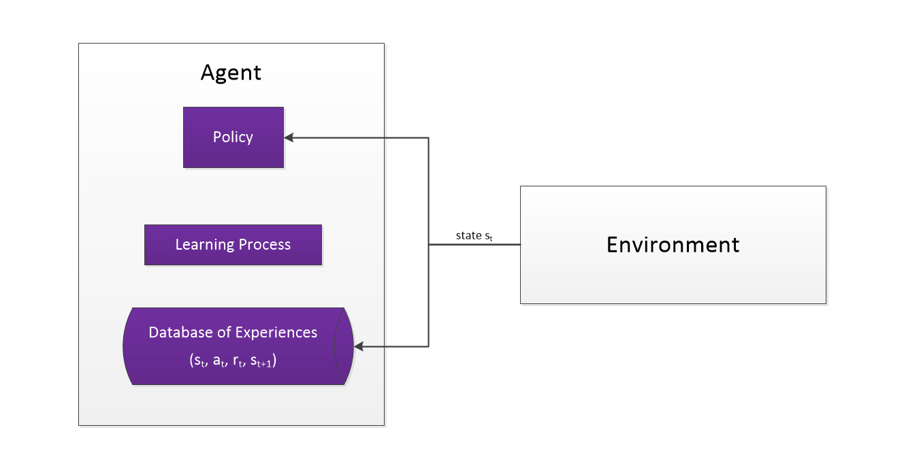

# The Reinforcement Learning Process

The following diagram illustrates the key mechanisms underlying the learning process in model-free reinforcement learning algorithms.
It shows how the agent interacts with the environment, collects experiences, and periodically updates its policy based on those experiences.

<div id="carousel" style="width: 85%; text-align:center; margin-bottom: 16px; border: 1px solid #ddd;">
  
  <div style="margin-bottom: 10px;">
    <button onclick="prevImage()" style="padding: 0 10px; margin-right: 10px;">&#8678; Prev</button>
    <button onclick="nextImage()" style="padding: 0 10px;">Next &#8680;</button>
  </div>
  <div id="caption" style="margin: 10px; text-align: left;"></div>
</div>

<script>
  const images = [
    {src: '../_static/images/agent-env-step1.png', caption: '<b>Step 1</b>: The agent receives the observable state from the environment.'},
    {src: '../_static/images/agent-env-step2.png', caption: '<b>Step 2</b>: The agent uses its policy to select an action, passing it to the environment.'},
    {src: '../_static/images/agent-env-step3.png', caption: '<b>Step 3</b>: The execution of the action results in a new state and produces a reward. The environment is specifically designed to provide feedback to the agent, returning (high) positive rewards for desirable states and low/negative rewards for undesirable states; rewards may be sparse, i.e. rewards for intermediate states may be zero. The agent records the action taken, the state transition and the reward received in its database of experiences (replay buffer). The agent repeats the process several times in order to fill the replay buffer with new transitions.'},
    {src: '../_static/images/agent-env-step4.png', caption: '<b>Step 4</b>: Periodically, after having collected enough experiences, the agent uses the experience data to update its policy, i.e. the way it selects actions. The learning algorithm defines the corresponding update mechanism.'},
  ];
  let index = 0;

  function updateImage() {
    document.getElementById('carousel-image').src = images[index].src;
    document.getElementById('caption').innerHTML = images[index].caption;
  }

  function nextImage() {
    index = (index + 1) % images.length;
    updateImage();
  }

  function prevImage() {
    index = (index - 1 + images.length) % images.length;
    updateImage();
  }

  updateImage();
</script>

Accordingly, the key entities involved in the learning process are:
  * The **environment**: This is the system the agent interacts with. 
    It provides the agent with observable states and rewards based on the actions taken by the agent.
  * The agent's **policy**: This is the strategy used by the agent to decide which action to take in a given state. 
    The policy can be deterministic or stochastic and is typically represented by a neural network in deep reinforcement learning.
  * The **replay buffer**: This is a data structure used to store the agent's experiences, which consist of state transitions, 
    actions taken, and rewards received. 
    The agent learns from past experience by sampling mini-batches from the buffer during the policy update phase.
  * The **learning algorithm**: This defines how the agent updates its policy based on the experiences stored in the replay buffer. 
    Different algorithms have different update mechanisms, which can significantly affect the learning performance. 
    In some cases, the algorithm may also involve additional components (specifically neural networks), such as target networks or value 
    functions.

These entities have direct correspondences in Tianshou's codebase:
  * The environment is represented by an instance of a class that inherits from `gymnasium.Env`, which is a standard interface for 
    reinforcement learning environments. 
    In practice, environments are typically vectorized to enable parallel interactions, increasing efficiency.
  * The policy is encapsulated in the {class}`~tianshou.algorithm.algorithm_base.Policy` class, which provides methods for action selection.
  * The replay buffer is implemented in the {class}`~tianshou.data.buffer.buffer_base.ReplayBuffer` class.
    A {class}`~tianshou.data.collector.Collector` instance is used to manage the addition of new experiences to the replay buffer as the agent interacts with the 
    environment. 
    During the learning phase, the replay buffer may be sampled, providing an instance of {class}`~tianshou.data.batch.Batch` for the policy update.
  * The abstraction for learning algorithms is given by the {class}`~tianshou.algorithm.algorithm_base.Algorithm` class, which defines how to update the policy using data from the 
    replay buffer.

(structuring-the-process)=
## Structuring the Process

The learning process itself is reified in Tianshou's {class}`~tianshou.trainer.trainer.Trainer` class, which orchestrates the interaction between the agent and the 
environment, manages the replay buffer, and coordinates the policy updates according to the specified learning algorithm.  

In general, the process can be described as executing a number of epochs as follows:

* **epoch**:
  * repeat until a sufficient number of steps is reached (for online learning, typically environment step count)
    * **training step**:
      * for online learning algorithms …
        * **collection step**: collect state transitions in the environment by running the agent
        * (optionally) conduct a test step if collected data indicates promising behaviour
      * **update step**: apply gradient updates using the algorithm’s update logic.  
        The update is based on … 
        * data from the preceding collection step only (on-policy learning)
        * data from the collection step and previous data (off-policy learning)
        * data from a user-provided replay buffer (offline learning)
  * **test step**
    * collect test episodes from dedicated test environments and evaluate agent performance
    * (optionally) stop training early if performance is sufficiently high

```{admonition} Glossary
:class: note
The above introduces some of the key terms used throughout Tianshou. 
```

Note that the above description encompasses several modes of model-free reinforcement learning, including:
 * online learning (where the agent continuously interacts with the environment in order to collect new experiences)
   * on-policy learning (where the policy is updated based on data collected using the current policy only)
   * off-policy learning (where the policy is updated based on data collected using the current and previous policies)
 * offline learning (where the replay buffer is pre-filled and not updated during training)

In Tianshou, the {class}`~tianshou.trainer.trainer.Trainer` and {class}`~tianshou.algorithm.algorithm_base.Algorithm` classes are specialised to handle these different modes accordingly.
