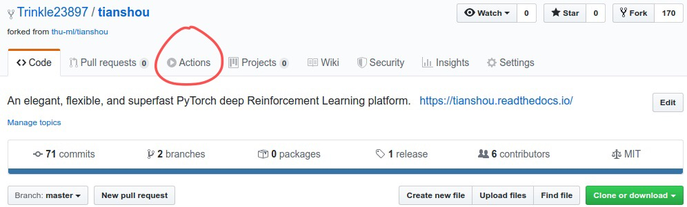
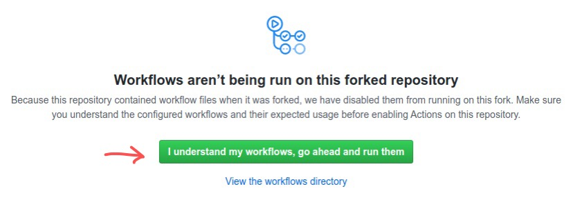
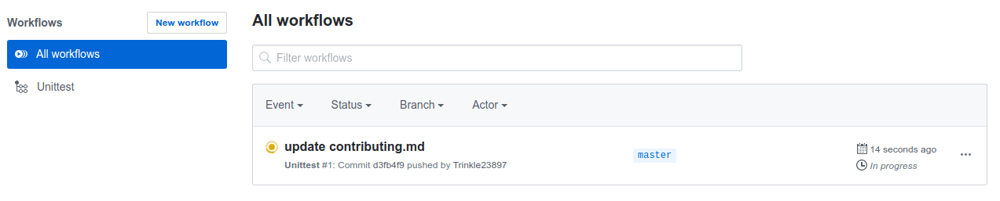

Contributing to Tianshou
========================

Install Develop Version
-----------------------

Tianshou is built and managed by `poetry <https://python-poetry.org/>`_. For example,
to install all relevant requirements in editable mode you can simply call

.. code-block:: bash

  $ poetry install --with dev

PEP8 Code Style Check and Formatting
----------------------------------------

Please set up pre-commit by running

.. code-block:: bash

    $ pre-commit install

in the main directory. This should make sure that your contribution is properly
formatted before every commit.

The code is inspected and formatted by `black` and `ruff`. They are executed as
pre-commit hooks. In addition, `poe the poet` tasks are configured.
Simply run `poe` to see the available tasks.
E.g, to format and check the linting manually you can run:

.. code-block:: bash

    $ poe format
    $ poe lint

Type Check
----------

We use `mypy <https://github.com/python/mypy/>`_ to check the type annotations. To check, in the main directory, run:

.. code-block:: bash

    $ poe type-check

Test Locally
------------

This command will run automatic tests in the main directory

.. code-block:: bash

    $ poe test

Test by GitHub Actions
----------------------

1. Click the ``Actions`` button in your own repo:

2. Click the green button:

3. You will see ``Actions Enabled.`` on the top of html page.

4. When you push a new commit to your own repo (e.g. ``git push``), it will automatically run the test in this page:

Documentation
-------------

Documentations are written under the ``docs/`` directory as ReStructuredText (``.rst``) files. ``index.rst`` is the main page. A Tutorial on ReStructuredText can be found `here <https://pythonhosted.org/an_example_pypi_project/sphinx.html>`_.

API References are automatically generated by `Sphinx <http://www.sphinx-doc.org/en/stable/>`_ according to the outlines under ``docs/api/`` and should be modified when any code changes.

To compile documentation into webpage, run

.. code-block:: bash

    $ poe doc-build

The generated webpage is in ``docs/_build`` and can be viewed with browser (http://0.0.0.0:8000/).

Chinese documentation is in https://tianshou.readthedocs.io/zh/latest/.

Documentation Generation Test
-----------------------------

We have the following three documentation tests:

1. pydocstyle (as part of ruff): test all docstring under ``tianshou/``;

2. doc8 (as part of ruff): test ReStructuredText format;

3. sphinx spelling and test: test if there is any error/warning when generating front-end html documentation.

To check, in the main directory, run:

.. code-block:: bash

    $ poe lint
    $ poe doc-build
