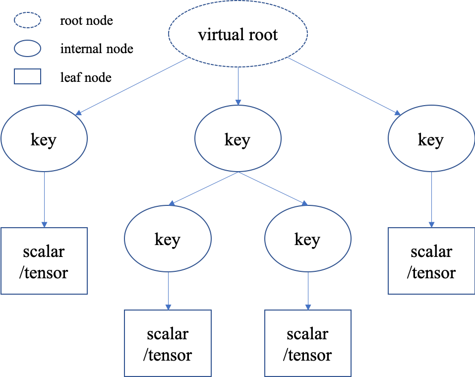
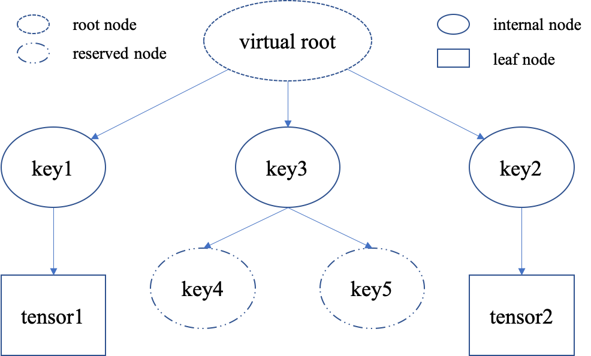

.. _batch_concept:

Understand Batch
==========================

:class:`tianshou.data.Batch` is the internal data structure extensively used in Tianshou. It is designed to store and manipulate hierarchical named tensors. This tutorial aims to help users correctly understand the concept and the behavior of ``Batch`` so that users can make the best of Tianshou.

Hierarchical Named Tensors
---------------------------

"Hierarchical named tensors" refers to a set of tensors where their names form a hierarchy. Suppose there are four tensors ``[t1, t2, t3, t4]`` with names ``[name1, name2, name3, name4]``, where ``name1`` and ``name2`` belong to the same namespace ``name0``, then the full name of tensor ``t1`` is ``name0.name1``. That is, the hierarchy lies in the names of tensors.

The requirement of storing and manipulating hierarchical named tensors is very intense, especially in reinforcement learning. For example, the abstraction of RL is very simple, just ``state, reward, done = env.step(action)``, but we have to deal with the heterogeneity of reinforcement learning problems. ``reward`` and ``done`` are simple, they are mostly scalar values. However, the ``state`` varies with environments. ``state`` can be simply a vector, a tensor, or a camera input combined with sensory input. In the last case, it is natural to store them as hierarchical named tensors. This hierarchy can go beyond ``state``: we can store ``state``, ``reward``, and ``done`` together as hierarchical named tensors.

Note that, storing hierarchical named tensors is as easy as creating nested dictionary objects:

.. code-block:: python

    {
        'done': done,
        'reward': reward,
        'state': {
            'camera': camera,
            'sensory': sensory
        }
    }

The real problem is how to **manipulate them**, such as adding new transition tuples into replay buffer and dealing with their heterogeneity. ``Batch`` is designed to easily create, store, and manipulate these hierarchical named tensors.

What Does Batch Contain
------------------------

The content of ``Batch`` objects can be defined by `regular expressions <https://en.wikipedia.org/wiki/Regular_expression>`_ as the following rules.

    1. Batch -> Batch() | (key, value)+

    2. key -> string

    3. value -> scalar | tensor | Batch

    4. tensor -> np.ndarray (dtype can be np.bool, np.number, or np.object), torch.Tensor

    5. scalar -> bool, number, np.number, np.bool, object (but not Batch/dict/tensor objects)

Below we describe the detailed explanation of each rule.

1. A ``Batch`` object can be an empty ``Batch()``, or have at least one key-value pairs.

.. note::

    Besides being an empty Batch, ``Batch()`` has another important usage to reserve keys. See :ref:`key_reservation` for details.

2. The keys are always strings (they are names of corresponding values).

3. The values can be scalars, tensors, or Batch objects. The recurse definition makes it possible to form a hierarchy of batches.

4. Tensors are the most important values. In short, tensors are n-dimensional arrays of the same data type. We support two types of tensors: `PyTorch <https://pytorch.org/>`_ tensor type ``torch.Tensor`` and `NumPy <https://numpy.org/>`_ tensor type ``np.ndarray``.

.. note::

    Both ``torch.Tensor`` and ``np.ndarray`` can store scalar values, too. Be careful when you are using ``torch.Tensor`` and ``np.ndarray`` to store scalars like ``np.array(3)``.

.. note::

    The data types of tensors are bool and numbers (any size of int and float as long as they are supported by NumPy or PyTorch). Besides, NumPy supports ndarray of objects and we take advantage of this feature to store non-number objects in ``Batch``. If one wants to store data that are neither boolean nor numbers (such as strings and sets), they can store the data in ``np.ndarray`` with the ``np.object`` data type. This way, ``Batch`` can store any type of python objects.

5. Scalars are also valid values. A scalar is a single boolean, number, or object. They can be python scalar (``False, 1, 2.3, None, 'hello'``) or NumPy scalar (``np.bool_(True), np.int32(1), np.float64(2.3)``). They just shouldn't be mixed up with Batch/dict/tensors.

.. note::

    ``Batch`` cannot store ``dict`` objects, because internally ``Batch`` uses ``dict`` to store data. During construction, ``dict`` objects will be automatically converted to ``Batch`` objects.

By expanding nested ``Batch`` objects, we can describe the structure of ``Batch`` using a tree. There is always a "virtual root" node to represent the whole ``Batch`` object; internal nodes are keys (names), and leaf nodes are scalars or tensors. Having a picture of the structure in mind helps when we deal with ``Batch`` objects.

Construction of Batch
---------------------

There are a variety of ways to construct a ``Batch`` object. One can construct a ``Batch`` object from a ``dict``, or using ``kwargs``. Construction from other ``Batch`` objects is deferred to later sections.

1. Constructing a ``Batch`` object from a dict is as easy as passing the dict object ``batch_dict`` to ``Batch(batch_dict)``. The following code snippet shows several use cases.

.. code-block:: python

    >>> # directly passing a dict object (possibly nested) is ok
    >>> data = Batch({'a': 4, 'b': [5, 5], 'c': '2312312'})
    >>> # the list will automatically be converted to numpy array
    >>> data.b
    array([5, 5])
    >>> data.b = np.array([3, 4, 5])
    >>> print(data)
    Batch(
        a: 4,
        b: array([3, 4, 5]),
        c: '2312312',
    )
    >>> # a list of dict objects (possibly nested) will be automatically stacked
    >>> data = Batch([{'a': 0.0, 'b': "hello"}, {'a': 1.0, 'b': "world"}])
    >>> print(data)
    Batch(
        a: array([0., 1.]),
        b: array(['hello', 'world'], dtype=object),
    )

2. Keyword arguments are ok for ``Batch`` objects, too.

.. code-block:: python

    >>> # construct a Batch with keyword arguments
    >>> data = Batch(a=[4, 4], b=[5, 5], c=[None, None])
    >>> print(data)
    Batch(
        a: array([4, 4]),
        b: array([5, 5]),
        c: array([None, None], dtype=object),
    )
    >>> # combining keyword arguments and batch_dict works fine
    >>> data = Batch({'a':[4, 4], 'b':[5, 5]}, c=[None, None]) # the first argument is a dict, and 'c' is a keyword argument
    >>> print(data)
    Batch(
        a: array([4, 4]),
        b: array([5, 5]),
        c: array([None, None], dtype=object),
    )
    >>> arr = np.zeros((3, 4))
    >>> # By default, Batch only keeps the reference to the data, but it also supports data copying
    >>> data = Batch(arr=arr, copy=True) # data.arr now is a copy of 'arr'

.. note::

    Some names have special meaning for the internal usage in Tianshou. For example, ``copy`` is a flag in ``Batch.__init__`` and one should not use "copy" as a name.

    Below is an incomplete list of names internally used in Tianshou. Names start with "_" or "__" should also be avoided because they may have a conflict with internal names.

    * ``obs``: the observation of step :math:`t` ;
    * ``act``: the action of step :math:`t` ;
    * ``rew``: the reward of step :math:`t` ;
    * ``done``: the done flag of step :math:`t` ;
    * ``obs_next``: the observation of step :math:`t+1` ;
    * ``info``: the info of step :math:`t` (in ``gym.Env``, the ``env.step()`` function returns 4 items, and the last one is ``info``);
    * ``policy``: the data computed by policy in step :math:`t`;

Data Manipulation With Batch
-----------------------------

A ``Batch`` object ``b`` corresponds to a tree structure. Users can access the internal data by ``b.key`` or ``b[key]``, where ``b.key`` finds the sub-tree with ``key`` as the root node. If the result is a sub-tree with non-empty keys, the key-reference can be chained, i.e. ``b.key.key1.key2...key3``. When it reaches a leaf node, users get the data (scalars/tensors) stored in that ``Batch`` object.

.. code-block:: python

        >>> data = Batch(a=4, b=[5, 5])
        >>> print(data.b)
        [5 5]
        >>> # obj.key is equivalent to obj["key"]
        >>> print(data["a"])
        4
        >>> # iterating over data items like a dict is supported
        >>> for key, value in data.items():
        >>>     print(f"{key}: {value}")
        a: 4
        b: [5, 5]
        >>> # obj.keys() and obj.values() work just like dict.keys() and dict.values()
        >>> for key in data.keys():
        >>>     print(f"{key}")
        a
        b
        >>> # obj.update() behaves like dict.update()
        >>> # this is the same as data.c = 1; data.c = 2; data.e = 3;
        >>> data.update(c=1, d=2, e=3)
        >>> print(data)
        Batch(
            a: 4,
            b: array([5, 5]),
            c: 1,
            d: 2,
            e: 3,
        )

.. note::

    If ``data`` is a ``dict`` object, ``for x in data`` iterates over keys in the dict. However, it has a different meaning for ``Batch`` objects: ``for x in data`` iterates over ``data[0], data[1], ... data[-1]``. An example is given below.

``Batch`` also partially reproduces the NumPy ndarray APIs. It supports advanced slicing, such as ``batch[:, i]`` so long as the slice is valid. Broadcast mechanism of NumPy works for ``Batch``, too.

.. code-block:: python

    >>> # initialize Batch with tensors
    >>> data = Batch(a=np.array([[0.0, 2.0], [1.0, 3.0]]), b=[[5, -5], [1, -2]])
    >>> # access the first item of all the stored tensors, while keeping the structure of Batch
    >>> print(data[0])
    Batch(
        a: array([0., 2.])
        b: array([ 5, -5]),
    )
    >>> # iterates over ``data[0], data[1], ... data[-1]``
    >>> for sample in data:
    >>>     print(sample.a)
    [0. 2.]
    [1. 3.]

    >>> # Advanced slicing works just fine
    >>> # Arithmetic operations are passed to each value in the Batch, with broadcast enabled
    >>> data[:, 1] += 1
    >>> print(data)
    Batch(
        a: array([[0., 3.],
                  [1., 4.]]),
        b: array([[ 5, -4]]),
    )

    >>> # amazingly, you can directly apply np.mean to a Batch object
    >>> print(np.mean(data))
    Batch(
        a: 1.5,
        b: -0.25,
    )

Stacking and concatenating multiple ``Batch`` instances, or split an instance into multiple batches, they are all easy and intuitive in Tianshou. For now, we stick to the aggregation (stack/concatenate) of homogeneous batches (with the same structure). Stack/concatenation of heterogeneous batches are discussed in :ref:`aggregation`.

.. code-block:: python

    >>> data_1 = Batch(a=np.array([0.0, 2.0]), b=5)
    >>> data_2 = Batch(a=np.array([1.0, 3.0]), b=-5)
    >>> data = Batch.stack((data_1, data_2))
    >>> print(data)
    Batch(
        b: array([ 5, -5]),
        a: array([[0., 2.],
                  [1., 3.]]),
    )
    >>> # split supports random shuffling
    >>> data_split = list(data.split(1, shuffle=False))
    >>> print(list(data.split(1, shuffle=False)))
    [Batch(
        b: array([5]),
        a: array([[0., 2.]]),
    ), Batch(
        b: array([-5]),
        a: array([[1., 3.]]),
    )]
    >>> data_cat = Batch.cat(data_split)
    >>> print(data_cat)
    Batch(
        b: array([ 5, -5]),
        a: array([[0., 2.],
                  [1., 3.]]),
    )

.. note::

    There are two versions of stack and concatenate in ``Batch``. One is the static version (static function of the ``Batch`` class) ``Batch.stack`` and ``Batch.cat``; the other is the member functions ``Batch.stack_`` and ``Batch.cat_`` which modify the object itself. In short, ``obj.stack_([a, b])`` is the same as ``Batch.stack([obj, a, b])``, and ``obj.cat_([a, b])`` is the same as ``Batch.cat([obj, a, b])``. Considering the frequent requirement of concatenating two ``Batch`` objects, Tianshou also supports ``obj.cat_(a)`` to be an alias of ``obj.cat_([a])``.

.. _key_reservation:

Key Reservations
----------------

In many cases, we know in the first place what keys we have, but we do not know the shape of values until we run the environment. To deal with this, Tianshou supports key reservations: **reserve a key and use a placeholder value**.

The usage is easy: just use ``Batch()`` to be the value of reserved keys.

.. code-block:: python

    >>> a = Batch(b=Batch()) # 'b' is a reserved key
    >>> # this is called hierarchical key reservation
    >>> a = Batch(b=Batch(c=Batch()), d=Batch()) # 'c' and 'd' are reserved key
    >>> # the structure of this last Batch is shown below
    >>> a = Batch(key1=tensor1, key2=tensor2, key3=Batch(key4=Batch(), key5=Batch()))

Still, we can use a tree to show the structure of ``Batch`` objects with reserved keys, where reserved keys are special internal nodes that do not have attached leaf nodes.

.. note::

    Reserved keys mean that in the future there will eventually be values attached to them. The values can be scalars, tensors, or even **Batch** objects. Understanding this is critical to understand the behavior of ``Batch`` when dealing with heterogeneous Batches.

The introduction of reserved keys gives rise to the need to check if a key is reserved. Tianshou provides ``Batch.is_empty`` to achieve this.

The ``Batch.is_empty`` function has an option to decide whether to identify direct emptiness (just a ``Batch()``) or to identify recurse emptiness (a ``Batch`` object without any scalar/tensor leaf nodes).

The following code snippet is self-illustrative.

.. code-block:: python

    >>> Batch().is_empty()
    True
    >>> Batch(a=Batch(), b=Batch(c=Batch())).is_empty()
    False
    >>> Batch(a=Batch(), b=Batch(c=Batch())).is_empty(recurse=True)
    True
    >>> Batch(d=1).is_empty()
    False
    >>> Batch(a=np.float64(1.0)).is_empty()
    False

.. note::

    Do not get confused with ``Batch.is_empty`` and ``Batch.empty``. ``Batch.empty`` and its in-place variant ``Batch.empty_`` are used to set some values to zeros. Check the API documentation for further details.

Length and Shape
----------------

The most common usage of ``Batch`` is to store a Batch of data. The term "Batch" comes from the deep learning community to denote a mini-batch of sampled data from the whole dataset. In this regard, "Batch" typically means a collection of tensors whose first dimensions are the same. Then the length of a ``Batch`` object is simply the batch-size.

If all the leaf nodes in a ``Batch`` object are tensors, but they have different lengths, they can be readily stored in ``Batch``. However, for ``Batch`` of this kind, the ``len(obj)`` seems a bit ambiguous. Currently, Tianshou returns the length of the shortest tensor, but we strongly recommend that users do not use the ``len(obj)`` operator on ``Batch`` objects with tensors of different lengths.

.. note::

    Following the convention of scientific computation, scalars have no length. If there is any scalar leaf node in a ``Batch`` object, an exception will occur when users call ``len(obj)``.

    In addition, values of reserved keys are undetermined, so they have no length, neither. Or, to be specific, values of reserved keys have lengths of **any**. When there is a mix of tensors and reserved keys, the latter will be ignored in ``len(obj)`` and the minimum length of tensors is returned. When there is not any tensor in the ``Batch`` object, Tianshou raises an exception, too.

The ``obj.shape`` attribute of ``Batch`` behaves somewhat similar to ``len(obj)``:

1. If all the leaf nodes in a ``Batch`` object are tensors with the same shape, that shape is returned.

2. If all the leaf nodes in a ``Batch`` object are tensors but they have different shapes, the minimum length of each dimension is returned.

3. If there is any scalar value in a ``Batch`` object, ``obj.shape`` returns ``[]``.

4. The shape of reserved keys is undetermined, too. We treat their shape as ``[]``.

The following code snippet illustrates the behavior of ``len`` and ``obj.shape``.

.. code-block:: python

    >>> data = Batch(a=[5., 4.], b=np.zeros((2, 3, 4)))
    >>> data.shape
    [2]
    >>> len(data)
    2
    >>> data[0].shape
    []
    >>> len(data[0])
    TypeError: Object of type 'Batch' has no len()

.. _aggregation:

Aggregation of Heterogeneous Batches
------------------------------------

In this section, we talk about aggregation operators (stack / concatenate) on heterogeneous ``Batch`` objects.

.. note::

    Here we only consider the heterogeneity in the structure of ``Batch`` objects. The aggregation operators are eventually done by NumPy/PyTorch operators (``np.stack, np.concatenate, torch.stack, torch.cat``). Heterogeneity in values can fail these operators (such as stacking ``np.ndarray`` with ``torch.Tensor``, or stacking tensors with different shapes) and an exception will be raised.

First, let's check some examples to have an intuitive understanding of the behavior.

.. code-block:: python

    >>> # examples of stack
    >>> a = Batch(a=np.zeros([4, 4]), common=Batch(c=np.zeros([4, 5])))
    >>> b = Batch(b=np.zeros([4, 6]), common=Batch(c=np.zeros([4, 5])))
    >>> c = Batch.stack([a, b])
    >>> c.a.shape
    (2, 4, 4)
    >>> c.b.shape
    (2, 4, 6)
    >>> c.common.c.shape
    (2, 4, 5)
    >>> # None or 0 is padded with appropriate shape
    >>> data_1 = Batch(a=np.array([0.0, 2.0]))
    >>> data_2 = Batch(a=np.array([1.0, 3.0]), b='done')
    >>> data = Batch.stack((data_1, data_2))
    >>> print(data)
    Batch(
        a: array([[0., 2.],
                  [1., 3.]]),
        b: array([None, 'done'], dtype=object),
    )
    >>> # examples of cat
    >>> a = Batch(a=np.zeros([3, 4]), common=Batch(c=np.zeros([3, 5])))
    >>> b = Batch(b=np.zeros([4, 3]), common=Batch(c=np.zeros([4, 5])))
    >>> c = Batch.cat([a, b])
    >>> c.a.shape
    (7, 4)
    >>> c.b.shape
    (7, 3)
    >>> c.common.c.shape
    (7, 5)

The behavior is natural: for keys that are not shared across all batches, batches that do not have these keys will be padded by zeros (or ``None`` if the data type is ``np.object``).

However, there are some cases when batches are too heterogeneous that they cannot be aggregated:

.. code-block:: python

    >>> a = Batch(a=np.zeros([4, 4]))
    >>> b = Batch(a=Batch(b=Batch()))
    >>> # this will raise an exception
    >>> c = Batch.stack([a, b])

Then how to determine if batches can be aggregated? Let's rethink the purpose of reserved keys. What is the advantage of ``a1=Batch(b=Batch())`` over ``a2=Batch()``? The only difference is that ``a1.b`` returns ``Batch()`` but ``a2.b`` raises an exception. That's to say, **we reserve keys for attribute reference**.

The following definition of *key chain applicability* is required to continue the discussion.

Key chain applicability: for a ``Batch`` object ``b``, we say the key chain (a list of strings) ``k``applies to ``b`` if and only if:

    1. ``k`` is empty,

    2. or: ``k`` has a single element ``key`` and ``b.key`` is valid

    3. or: ``k`` has more than one element, the first element ``key`` of ``k`` can be used for ``b.key``, and the rest of keys in ``k``apply to ``b.key``.

Intuitively, this says that a key chain ``k=[key1, key2, ..., keyn]``applies to ``b`` if the expression ``b.key1.key2....keyn`` is valid. The above definition just makes the intuition more formal. Let's denote the result ``b.key1.key2....keyn`` as ``b[k]`` if applicable.

With the concept of key chain applicability, we can formally define when batches can be aggregated: for a set of ``Batch`` objects denoted as :math:`S`, they can be aggregated if there exists a ``Batch`` object ``b`` satisfying the following rules:

    1. Key chain applicability: For any object ``bi`` in :math:`S`, any key chain ``k`` that applies to this object is also applicable to ``b``.

    2. Type consistency: If ``bi[k]`` is not ``Batch()`` (the last key in the key chain is not a reserved key), then the type of ``b[k]`` should be the same as ``bi[k]``.

The key chain applicability rises from the motivation of reserved keys. The type consistency requirement rises from the fact that, if we have a scalar/tensor value, that position in the aggregated ``Batch`` object should also be a scalar/tensor.

If there exists ``b`` that satisfies these rules, it is clear that adding more reserved keys into ``b`` will not break these rules and there will be infinitely many ``b`` that can satisfy these rules. Among them, there will be an object with the least number of keys, and that is the answer to aggregating :math:`S`.

The above definition precisely defines the structure of the result of stacking/concatenating batches. The values are relatively easy to define: for any key chain ``k`` that applies to ``b``, ``b[k]`` is the stack/concatenation of ``[bi[k] for bi in S]`` (if ``k``does not apply to ``bi``, the appropriate size of zeros or ``None`` are filled automatically). If ``bi[k]`` are all ``Batch()``, then the aggregation result is also an empty ``Batch()``.

Conceptually, how to aggregate batches is well done. And it is enough to understand the behavior of ``Batch`` objects during aggregation. Implementation is another story, though. Fortunately, Tianshou users do not have to worry about it. Just have the conceptual image in mind and you are all set!

.. note::

    ``Batch.cat`` and ``Batch.cat_`` does not support ``axis`` argument as ``np.concatenate`` and ``torch.cat``.

    ``Batch.stack`` and ``Batch.stack_`` support the ``axis`` argument so that one can stack batches besides the first dimension. But be cautious, if there are keys that are not shared across all batches, ``stack`` with ``axis != 0`` is undefined, and will cause an exception.

Miscellaneous Notes
-------------------

1. ``Batch`` is serializable and therefore Pickle compatible. ``Batch`` objects can be saved to disk and later restored by the python ``pickle`` module. This pickle compatibility is especially important for distributed sampling from environments.

2. It is often the case that the observations returned from the environment are NumPy ndarrays but the policy requires ``torch.Tensor`` for prediction and learning. In this regard, Tianshou provides helper functions to convert the stored data in-place into Numpy arrays or Torch tensors.

.. code-block:: python

    >>> data = Batch(a=np.zeros((3, 4)))
    >>> data.to_torch(dtype=torch.float32, device='cpu')
    >>> print(data.a)
    tensor([[0., 0., 0., 0.],
            [0., 0., 0., 0.],
            [0., 0., 0., 0.]])
    >>> # data.to_numpy is also available
    >>> data.to_numpy()

Conclusion
----------

In this tutorial, we learned about the concept of ``Batch``, what it is designed to store, how to construct ``Batch`` objects, and how to manipulate them. We also discussed important features of ``Batch``: key reservation and aggregation of heterogeneous batches.
