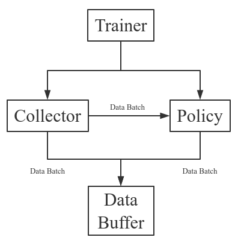

Basic Concepts in Tianshou
==========================

Tianshou has split a Reinforcement Learning agent training procedure into these parts: trainer, collector, policy, and data buffer. The general control flow can be discribed as:

Data Batch
----------

Tianshou provides :class:`~tianshou.data.Batch` as the internal data structure to pass any kinds of data to other method, for example, a collector gives a :class:`~tianshou.data.Batch` to policy for learning. Here is its usage:
::

    >>> import numpy as np
    >>> from tianshou.data import Batch
    >>> data = Batch(a=4, b=[5, 5], c='2312312')
    >>> data.b
    [5, 5]
    >>> data.b = np.array([3, 4, 5])
    >>> len(data.b)
    3
    >>> data.b[-1]
    5

In short, you can define a :class:`~tianshou.data.Batch` with any key-value pair.

Current implementation of Tianshou typically use 6 keys:

* ``obs``: observation of step t;
* ``act``: action of step t;
* ``rew``: reward of step t;
* ``done``: the done flag of step t;
* ``obs_next``: observation of step t+1;
* ``info``: info of step t (in ``gym.Env``, the ``env.step()`` function return 4 arguments, and the last one is ``info``);

:class:`~tianshou.data.Batch` has other methods:
::

    >>> data = Batch(obs=np.array([0, 11, 22]), rew=np.array([6, 6, 6]))
    >>> # here we test __getitem__
    >>> index = [2, 1]
    >>> data[index].obs
    array([22, 11])

    >>> data.append(data)  # how we use a list
    >>> data.obs
    array([0, 11, 22, 0, 11, 22])

    >>> # split whole data into multiple small batch
    >>> for d in data.split(size=2, permute=False):
    >>>     print(d.obs, d.rew)
    [ 0 11] [6 6]
    [22  0] [6 6]
    [11 22] [6 6]

Data Buffer
-----------

:class:`~tianshou.data.ReplayBuffer` stores data generated from interaction between the policy and environment. It stores basically 6 types of data as mentioned above (7 types with importance weight in :class:`~tianshou.data.PrioritizedReplayBuffer`). Here is the :class:`~tianshou.data.ReplayBuffer`'s usage:
::

    >>> from tianshou.data import ReplayBuffer
    >>> buf = ReplayBuffer(size=20)
    >>> for i in range(3):
    >>>     buf.add(obs=i, act=i, rew=i, done=i, obs_next=i + 1, info={})
    >>> buf.obs
    # since we set size = 20, len(buf.obs) == 20.
    array([0., 1., 2., 0., 0., 0., 0., 0., 0., 0., 0., 0., 0., 0., 0., 0., 0.,
           0., 0., 0.])

    >>> buf2 = ReplayBuffer(size=10)
    >>> for i in range(15):
    >>>     buf2.add(obs=i, act=i, rew=i, done=i, obs_next=i + 1, info={})
    >>> buf2.obs
    # since its size = 10, it only stores the last 10 steps' result.
    array([10., 11., 12., 13., 14.,  5.,  6.,  7.,  8.,  9.])

    >>> # move buf2's result into buf (keep the order of time meanwhile)
    >>> buf.update(buf2)
    array([ 0.,  1.,  2.,  5.,  6.,  7.,  8.,  9., 10., 11., 12., 13., 14.,
            0.,  0.,  0.,  0.,  0.,  0.,  0.])

    >>> # get a random sample from buffer, the batch_data is equal to buf[incide].
    >>> batch_data, indice = buf.sample(batch_size=4)
    >>> batch_data.obs == buf[indice].obs
    array([ True,  True,  True,  True])

The :class:`~tianshou.data.ReplayBuffer` is based on ``numpy.ndarray``. Tianshou provides other type of data buffer such as :class:`~tianshou.data.ListReplayBuffer` (based on list), :class:`tianshou.data.PrioritizedReplayBuffer` (based on Segment Tree and ``numpy.ndarray``). Check out the API documentation for more detail.

Policy
------

Tianshou aims to modularizing RL algorithms. It comes into several classes of policies in Tianshou. All of the policy classes must inherit :class:`~tianshou.policy.BasePolicy`.

For demonstration, we use the source code of policy gradient :class:`~tianshou.policy.PGPolicy`. Policy gradient computes each frame's return as:

.. math::

    G_t = \sum_{i=t}^T \gamma^{i - t}r_i = r_t + \gamma r_{t + 1} + \cdots + \gamma^{T - t} r_T

, where T is the terminal timestep, :math:`\gamma` is the discount factor :math:`\in [0, 1]`.

TODO

Collector
---------

TODO

Trainer
-------

Once you have a collector and a policy, you can start writing the training method for your RL agent. Trainer, to be honest, is a simple wrapper. It helps you save energy for writing the training loop.

Tianshou has two types of trainer: :meth:`~tianshou.trainer.onpolicy_trainer` and :meth:`~tianshou.trainer.offpolicy_trainer`, corresponding to on-policy algorithms (such as Policy Gradient) and off-policy algorithms (such as DQN). Please check out the API documentation for the usage.

There will be more types of trainer, for instance, multi-agent trainer.

Conclusion
----------

So far, we go through the overall framework of Tianshou. Really simple, isn't it?
