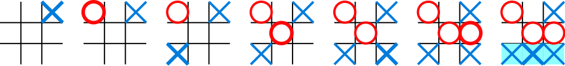

Multi-Agent RL
==============

In this section, we describe how to use Tianshou to implement multi-agent reinforcement learning. Specifically, we will design an algorithm to learn how to play `Tic Tac Toe <https://en.wikipedia.org/wiki/Tic-tac-toe>`_ (see the image below) against a random opponent.

Tic-Tac-Toe Environment
-----------------------

The scripts are located at ``test/pettingzoo/``. We have implemented :class:`~tianshou.env.PettingZooEnv` which can wrap any [PettingZoo](https://www.pettingzoo.ml/) environment. PettingZoo offers a 3x3 Tic-Tac-Toe environment, let's first explore it.
::

    >>> from tianshou.env import PettingZooEnv       # wrapper for PettingZoo environments
    >>> from pettingzoo.classic import tictactoe_v3  # the Tic-Tac-Toe environment to be wrapped
    >>> # This board has 3 rows and 3 cols (9 places in total)
    >>> # Players place 'x' and 'o' in turn on the board
    >>> # The player who first gets 3 consecutive 'x's or 'o's wins
    >>>
    >>> env = PettingZooEnv(tictactoe_v3.env())
    >>> obs = env.reset()
    >>> env.render()                                 # render the empty board
    board (step 0):
         |     |
      -  |  -  |  -
    _____|_____|_____
         |     |
      -  |  -  |  -
    _____|_____|_____
         |     |
      -  |  -  |  -
         |     |
    >>> print(obs)                                   # let's see the shape of the observation
    {'agent_id': 'player_1', 'obs': array([[[0, 0],
            [0, 0],
            [0, 0]],

           [[0, 0],
            [0, 0],
            [0, 0]],

           [[0, 0],
            [0, 0],
            [0, 0]]], dtype=int8), 'mask': [True, True, True, True, True, True, True, True, True]}

The observation variable ``obs`` returned from the environment is a ``dict``, with three keys ``agent_id``, ``obs``, ``mask``. This is a general structure in multi-agent RL where agents take turns. The meaning of these keys are:

- ``agent_id``: the id of the current acting agent. In our Tic-Tac-Toe case, the agent_id can be ``player_1`` or ``player_2``.

- ``obs``: the actual observation of the environment. In the Tic-Tac-Toe game above, the observation variable ``obs`` is a ``np.ndarray`` with the shape of (3, 3, 2). For ``player_1``, the first 3x3 plane represents the placement of Xs, and the second plane shows the placement of Os. The possible values for each cell are 0 or 1; in the first plane, 1 indicates that an X has been placed in that cell, and 0 indicates that X is not in that cell. Similarly, in the second plane, 1 indicates that an O has been placed in that cell, while 0 indicates that an O has not been placed. For ``player_2``, the observation is the same, but Xs and Os swap positions, so Os are encoded in plane 1 and Xs in plane 2.

- ``mask``: the action mask in the current timestep. In board games or card games, the legal action set varies with time. The mask is a boolean array. For Tic-Tac-Toe, index ``i`` means the place of ``i/N`` th row and ``i%N`` th column. If ``mask[i] == True``, the player can place an ``x`` or ``o`` at that position. Now the board is empty, so the mask is all the true, contains all the positions on the board.

.. note::

    There is no special formulation of ``mask`` either in discrete action space or in continuous action space. You can also use some action spaces like ``gym.spaces.Discrete`` or ``gym.spaces.Box`` to represent the available action space. Currently, we use a boolean array.

Let's play two steps to have an intuitive understanding of the environment.

::

    >>> import numpy as np
    >>> action = 0                                  # action is either an integer, or an np.ndarray with one element
    >>> obs, reward, done, info = env.step(action)  # the env.step follows the api of OpenAI Gym
    >>> print(obs)                                  # notice the change in the observation
    {'agent_id': 'player_2', 'obs': array([[[0, 1],
            [0, 0],
            [0, 0]],

           [[0, 0],
            [0, 0],
            [0, 0]],

           [[0, 0],
            [0, 0],
            [0, 0]]], dtype=int8), 'mask': [False, True, True, True, True, True, True, True, True]}
    >>> # reward has two items, one for each player: 1 for win, -1 for lose, and 0 otherwise
    >>> print(reward)
    [0. 0.]
    >>> print(done)                                 # done indicates whether the game is over
    False
    >>> # info is always an empty dict in Tic-Tac-Toe, but may contain some useful information in environments other than Tic-Tac-Toe.
    >>> print(info)
    {}

One worth-noting case is that the game is over when there is only one empty position, rather than when there is no position. This is because the player just has one choice (literally no choice) in this game.
::

    >>> # omitted actions: 3, 1, 4
    >>> obs, reward, done, info = env.step(2)  # player_1 wins
    >>> print((reward, done))
    ([1, -1], True)
    >>> env.render()
         |     |
      X  |  O  |  -
    _____|_____|_____
         |     |
      X  |  O  |  -
    _____|_____|_____
         |     |
      X  |  -  |  -
         |     |

After being familiar with the environment, let's try to play with random agents first!

Two Random Agents
-----------------

.. sidebar:: The relationship between MultiAgentPolicyManager (Manager) and BasePolicy (Agent)

     .. Figure:: ../_static/images/marl.png

Tianshou already provides some builtin classes for multi-agent learning. You can check out the API documentation for details. Here we use :class:`~tianshou.policy.RandomPolicy` and :class:`~tianshou.policy.MultiAgentPolicyManager`. The figure on the right gives an intuitive explanation.

::

    >>> from tianshou.data import Collector
    >>> from tianshou.env import DummyVectorEnv
    >>> from tianshou.policy import RandomPolicy, MultiAgentPolicyManager
    >>>
    >>> # agents should be wrapped into one policy,
    >>> # which is responsible for calling the acting agent correctly
    >>> # here we use two random agents
    >>> policy = MultiAgentPolicyManager([RandomPolicy(), RandomPolicy()], env)
    >>>
    >>> # need to vectorize the environment for the collector
    >>> env = DummyVectorEnv([lambda: env])
    >>>
    >>> # use collectors to collect a episode of trajectories
    >>> # the reward is a vector, so we need a scalar metric to monitor the training
    >>> collector = Collector(policy, env)
    >>>
    >>> # you will see a long trajectory showing the board status at each timestep
    >>> result = collector.collect(n_episode=1, render=.1)
    (only show the last 3 steps)
         |     |
      X  |  X  |  -
    _____|_____|_____
         |     |
      X  |  O  |  -
    _____|_____|_____
         |     |
      O  |  -  |  -
         |     |
         |     |
      X  |  X  |  -
    _____|_____|_____
         |     |
      X  |  O  |  -
    _____|_____|_____
         |     |
      O  |  -  |  O
         |     |
         |     |
      X  |  X  |  X
    _____|_____|_____
         |     |
      X  |  O  |  -
    _____|_____|_____
         |     |
      O  |  -  |  O
         |     |

Random agents perform badly. In the above game, although agent 2 wins finally, it is clear that a smart agent 1 would place an ``x`` at row 4 col 4 to win directly.

Train an MARL Agent
-------------------

So let's start to train our Tic-Tac-Toe agent! First, import some required modules.
::

    import argparse
    import os
    from copy import deepcopy
    from typing import Optional, Tuple

    import gym
    import numpy as np
    import torch
    from pettingzoo.classic import tictactoe_v3
    from torch.utils.tensorboard import SummaryWriter

    from tianshou.data import Collector, VectorReplayBuffer
    from tianshou.env import DummyVectorEnv
    from tianshou.env.pettingzoo_env import PettingZooEnv
    from tianshou.policy import (
        BasePolicy,
        DQNPolicy,
        MultiAgentPolicyManager,
        RandomPolicy,
    )
    from tianshou.trainer import offpolicy_trainer
    from tianshou.utils import TensorboardLogger
    from tianshou.utils.net.common import Net

The explanation of each Tianshou class/function will be deferred to their first usages. Here we define some arguments and hyperparameters of the experiment. The meaning of arguments is clear by just looking at their names.
::

    def get_parser() -> argparse.ArgumentParser:
        parser = argparse.ArgumentParser()
        parser.add_argument('--seed', type=int, default=1626)
        parser.add_argument('--eps-test', type=float, default=0.05)
        parser.add_argument('--eps-train', type=float, default=0.1)
        parser.add_argument('--buffer-size', type=int, default=20000)
        parser.add_argument('--lr', type=float, default=1e-4)
        parser.add_argument(
            '--gamma', type=float, default=0.9, help='a smaller gamma favors earlier win'
        )
        parser.add_argument('--n-step', type=int, default=3)
        parser.add_argument('--target-update-freq', type=int, default=320)
        parser.add_argument('--epoch', type=int, default=50)
        parser.add_argument('--step-per-epoch', type=int, default=1000)
        parser.add_argument('--step-per-collect', type=int, default=10)
        parser.add_argument('--update-per-step', type=float, default=0.1)
        parser.add_argument('--batch-size', type=int, default=64)
        parser.add_argument(
            '--hidden-sizes', type=int, nargs='*', default=[128, 128, 128, 128]
        )
        parser.add_argument('--training-num', type=int, default=10)
        parser.add_argument('--test-num', type=int, default=10)
        parser.add_argument('--logdir', type=str, default='log')
        parser.add_argument('--render', type=float, default=0.1)
        parser.add_argument(
            '--win-rate',
            type=float,
            default=0.6,
            help='the expected winning rate: Optimal policy can get 0.7'
        )
        parser.add_argument(
            '--watch',
            default=False,
            action='store_true',
            help='no training, '
            'watch the play of pre-trained models'
        )
        parser.add_argument(
            '--agent-id',
            type=int,
            default=2,
            help='the learned agent plays as the'
            ' agent_id-th player. Choices are 1 and 2.'
        )
        parser.add_argument(
            '--resume-path',
            type=str,
            default='',
            help='the path of agent pth file '
            'for resuming from a pre-trained agent'
        )
        parser.add_argument(
            '--opponent-path',
            type=str,
            default='',
            help='the path of opponent agent pth file '
            'for resuming from a pre-trained agent'
        )
        parser.add_argument(
            '--device', type=str, default='cuda' if torch.cuda.is_available() else 'cpu'
        )
        return parser

    def get_args() -> argparse.Namespace:
        parser = get_parser()
        return parser.parse_known_args()[0]

.. sidebar:: The relationship between MultiAgentPolicyManager (Manager) and BasePolicy (Agent)

     .. Figure:: ../_static/images/marl.png

The following ``get_agents`` function returns agents and their optimizers from either constructing a new policy, or loading from disk, or using the pass-in arguments. For the models:

- The action model we use is an instance of :class:`~tianshou.utils.net.common.Net`, essentially a multi-layer perceptron with the ReLU activation function;
- The network model is passed to a :class:`~tianshou.policy.DQNPolicy`, where actions are selected according to both the action mask and their Q-values;
- The opponent can be either a random agent :class:`~tianshou.policy.RandomPolicy` that randomly chooses an action from legal actions, or it can be a pre-trained :class:`~tianshou.policy.DQNPolicy` allowing learned agents to play with themselves.

Both agents are passed to :class:`~tianshou.policy.MultiAgentPolicyManager`, which is responsible to call the correct agent according to the ``agent_id`` in the observation. :class:`~tianshou.policy.MultiAgentPolicyManager` also dispatches data to each agent according to ``agent_id``, so that each agent seems to play with a virtual single-agent environment.

Here it is:
::

    def get_agents(
        args: argparse.Namespace = get_args(),
        agent_learn: Optional[BasePolicy] = None,
        agent_opponent: Optional[BasePolicy] = None,
        optim: Optional[torch.optim.Optimizer] = None,
    ) -> Tuple[BasePolicy, torch.optim.Optimizer, list]:
        env = get_env()
        observation_space = env.observation_space['observation'] if isinstance(
            env.observation_space, gym.spaces.Dict
        ) else env.observation_space
        args.state_shape = observation_space.shape or observation_space.n
        args.action_shape = env.action_space.shape or env.action_space.n
        if agent_learn is None:
            # model
            net = Net(
                args.state_shape,
                args.action_shape,
                hidden_sizes=args.hidden_sizes,
                device=args.device
            ).to(args.device)
            if optim is None:
                optim = torch.optim.Adam(net.parameters(), lr=args.lr)
            agent_learn = DQNPolicy(
                net,
                optim,
                args.gamma,
                args.n_step,
                target_update_freq=args.target_update_freq
            )
            if args.resume_path:
                agent_learn.load_state_dict(torch.load(args.resume_path))

        if agent_opponent is None:
            if args.opponent_path:
                agent_opponent = deepcopy(agent_learn)
                agent_opponent.load_state_dict(torch.load(args.opponent_path))
            else:
                agent_opponent = RandomPolicy()

        if args.agent_id == 1:
            agents = [agent_learn, agent_opponent]
        else:
            agents = [agent_opponent, agent_learn]
        policy = MultiAgentPolicyManager(agents, env)
        return policy, optim, env.agents

With the above preparation, we are close to the first learned agent. The following code is almost the same as the code in the DQN tutorial.

::

    def get_env():
        return PettingZooEnv(tictactoe_v3.env())

    def train_agent(
        args: argparse.Namespace = get_args(),
        agent_learn: Optional[BasePolicy] = None,
        agent_opponent: Optional[BasePolicy] = None,
        optim: Optional[torch.optim.Optimizer] = None,
    ) -> Tuple[dict, BasePolicy]:

        # ======== environment setup =========
        train_envs = DummyVectorEnv([get_env for _ in range(args.training_num)])
        test_envs = DummyVectorEnv([get_env for _ in range(args.test_num)])
        # seed
        np.random.seed(args.seed)
        torch.manual_seed(args.seed)
        train_envs.seed(args.seed)
        test_envs.seed(args.seed)

        # ======== agent setup =========
        policy, optim, agents = get_agents(
            args, agent_learn=agent_learn, agent_opponent=agent_opponent, optim=optim
        )

        # ======== collector setup =========
        train_collector = Collector(
            policy,
            train_envs,
            VectorReplayBuffer(args.buffer_size, len(train_envs)),
            exploration_noise=True
        )
        test_collector = Collector(policy, test_envs, exploration_noise=True)
        # policy.set_eps(1)
        train_collector.collect(n_step=args.batch_size * args.training_num)

        # ======== tensorboard logging setup =========
        log_path = os.path.join(args.logdir, 'tic_tac_toe', 'dqn')
        writer = SummaryWriter(log_path)
        writer.add_text("args", str(args))
        logger = TensorboardLogger(writer)

        # ======== callback functions used during training =========
        def save_best_fn(policy):
            if hasattr(args, 'model_save_path'):
                model_save_path = args.model_save_path
            else:
                model_save_path = os.path.join(
                    args.logdir, 'tic_tac_toe', 'dqn', 'policy.pth'
                )
            torch.save(
                policy.policies[agents[args.agent_id - 1]].state_dict(), model_save_path
            )

        def stop_fn(mean_rewards):
            return mean_rewards >= args.win_rate

        def train_fn(epoch, env_step):
            policy.policies[agents[args.agent_id - 1]].set_eps(args.eps_train)

        def test_fn(epoch, env_step):
            policy.policies[agents[args.agent_id - 1]].set_eps(args.eps_test)

        def reward_metric(rews):
            return rews[:, args.agent_id - 1]

        # trainer
        result = offpolicy_trainer(
            policy,
            train_collector,
            test_collector,
            args.epoch,
            args.step_per_epoch,
            args.step_per_collect,
            args.test_num,
            args.batch_size,
            train_fn=train_fn,
            test_fn=test_fn,
            stop_fn=stop_fn,
            save_best_fn=save_best_fn,
            update_per_step=args.update_per_step,
            logger=logger,
            test_in_train=False,
            reward_metric=reward_metric
        )

        return result, policy.policies[agents[args.agent_id - 1]]

    # ======== a test function that tests a pre-trained agent ======
    def watch(
        args: argparse.Namespace = get_args(),
        agent_learn: Optional[BasePolicy] = None,
        agent_opponent: Optional[BasePolicy] = None,
    ) -> None:
        env = get_env()
        policy, optim, agents = get_agents(
            args, agent_learn=agent_learn, agent_opponent=agent_opponent
        )
        policy.eval()
        policy.policies[agents[args.agent_id - 1]].set_eps(args.eps_test)
        collector = Collector(policy, env, exploration_noise=True)
        result = collector.collect(n_episode=1, render=args.render)
        rews, lens = result["rews"], result["lens"]
        print(f"Final reward: {rews[:, args.agent_id - 1].mean()}, length: {lens.mean()}")

    # train the agent and watch its performance in a match!
    args = get_args()
    result, agent = train_agent(args)
    watch(args, agent)

That's it. By executing the code, you will see a progress bar indicating the progress of training. After about less than 1 minute, the agent has finished training, and you can see how it plays against the random agent. Here is an example:

.. raw:: html

   

   
Play with random agent

::

         |     |
      -  |  -  |  -
    _____|_____|_____
         |     |
      -  |  -  |  X
    _____|_____|_____
         |     |
      -  |  -  |  -
         |     |
         |     |
      -  |  -  |  -
    _____|_____|_____
         |     |
      -  |  O  |  X
    _____|_____|_____
         |     |
      -  |  -  |  -
         |     |
         |     |
      -  |  -  |  -
    _____|_____|_____
         |     |
      X  |  O  |  X
    _____|_____|_____
         |     |
      -  |  -  |  -
         |     |
         |     |
      -  |  O  |  -
    _____|_____|_____
         |     |
      X  |  O  |  X
    _____|_____|_____
         |     |
      -  |  -  |  -
         |     |
         |     |
      -  |  O  |  -
    _____|_____|_____
         |     |
      X  |  O  |  X
    _____|_____|_____
         |     |
      -  |  X  |  -
         |     |
         |     |
      O  |  O  |  -
    _____|_____|_____
         |     |
      X  |  O  |  X
    _____|_____|_____
         |     |
      -  |  X  |  -
         |     |
         |     |
      O  |  O  |  X
    _____|_____|_____
         |     |
      X  |  O  |  X
    _____|_____|_____
         |     |
      -  |  X  |  -
         |     |
         |     |
      O  |  O  |  X
    _____|_____|_____
         |     |
      X  |  O  |  X
    _____|_____|_____
         |     |
      -  |  X  |  O
         |     |
    Final reward: 1.0, length: 8.0

.. raw:: html

   
 

Notice that, our learned agent plays the role of agent 2, placing ``o`` on the board. The agent performs pretty well against the random opponent! It learns the rule of the game by trial and error, and learns that four consecutive ``o`` means winning, so it does!

The above code can be executed in a python shell or can be saved as a script file (we have saved it in ``test/pettingzoo/test_tic_tac_toe.py``). In the latter case, you can train an agent by

.. code-block:: console

    $ python test_tic_tac_toe.py

By default, the trained agent is stored in ``log/tic_tac_toe/dqn/policy.pth``. You can also make the trained agent play against itself, by

.. code-block:: console

    $ python test_tic_tac_toe.py --watch --resume-path log/tic_tac_toe/dqn/policy.pth --opponent-path log/tic_tac_toe/dqn/policy.pth

Here is our output:

.. raw:: html

   

   
The trained agent play against itself

::

         |     |
      -  |  -  |  -
    _____|_____|_____
         |     |
      -  |  X  |  -
    _____|_____|_____
         |     |
      -  |  -  |  -
         |     |
         |     |
      -  |  O  |  -
    _____|_____|_____
         |     |
      -  |  X  |  -
    _____|_____|_____
         |     |
      -  |  -  |  -
         |     |
         |     |
      X  |  O  |  -
    _____|_____|_____
         |     |
      -  |  X  |  -
    _____|_____|_____
         |     |
      -  |  -  |  -
         |     |
         |     |
      X  |  O  |  -
    _____|_____|_____
         |     |
      -  |  X  |  -
    _____|_____|_____
         |     |
      -  |  -  |  O
         |     |
         |     |
      X  |  O  |  -
    _____|_____|_____
         |     |
      -  |  X  |  -
    _____|_____|_____
         |     |
      -  |  X  |  O
         |     |
         |     |
      X  |  O  |  O
    _____|_____|_____
         |     |
      -  |  X  |  -
    _____|_____|_____
         |     |
      -  |  X  |  O
         |     |
         |     |
      X  |  O  |  O
    _____|_____|_____
         |     |
      -  |  X  |  -
    _____|_____|_____
         |     |
      X  |  X  |  O
         |     |
         |     |
      X  |  O  |  O
    _____|_____|_____
         |     |
      -  |  X  |  O
    _____|_____|_____
         |     |
      X  |  X  |  O
         |     |
    Final reward: 1.0, length: 8.0

.. raw:: html

   
 

Well, although the learned agent plays well against the random agent, it is far away from intelligence.

Next, maybe you can try to build more intelligent agents by letting the agent learn from self-play, just like AlphaZero!

In this tutorial, we show an example of how to use Tianshou for multi-agent RL. Tianshou is a flexible and easy to use RL library. Make the best of Tianshou by yourself!
