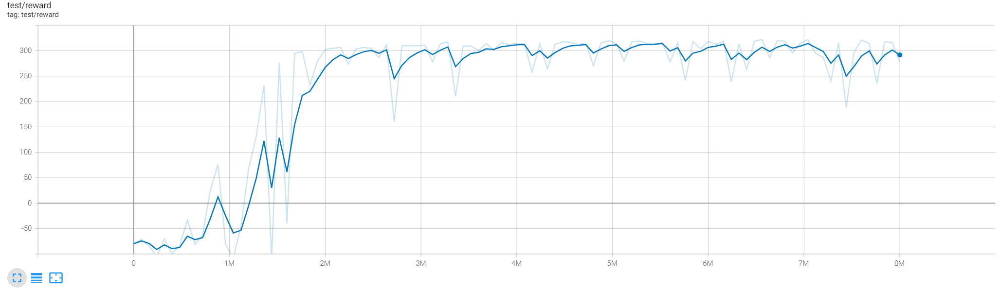

# Bipedal-Hardcore-SAC

- Our default choice: remove the done flag penalty, will soon converge to \~280 reward within 100 epochs (10M env steps, 3~4 hours, see the image below)
- If the done penalty is not removed, it converges much slower than before, about 200 epochs (20M env steps) to reach the same performance (\~200 reward)

# BipedalWalker-BDQ

- To demonstrate the cpabilities of the BDQ to scale up to big discrete action spaces, we run it on a discretized version of the BipedalWalker-v3 environment, where the number of possible actions in each dimension is 25, for a total of 25^4 = 390 625 possible actions. A usaual DQN architecture would use 25^4 output neurons for the Q-network, thus scaling exponentially with the number of action space dimensions, while the Branching architecture scales linearly and uses only 25*4 output neurons. 

