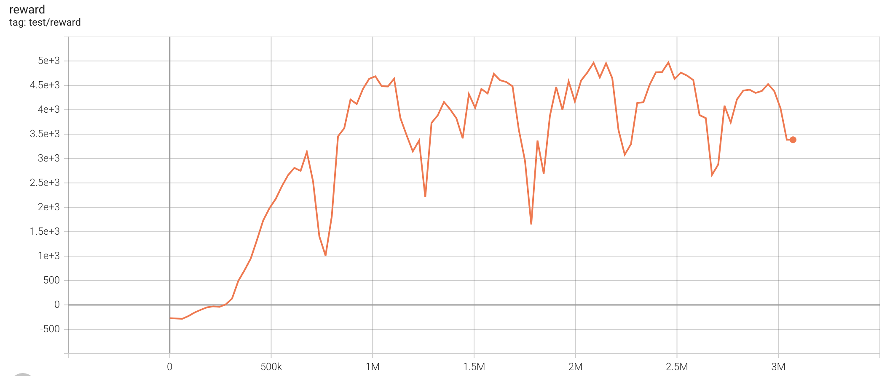
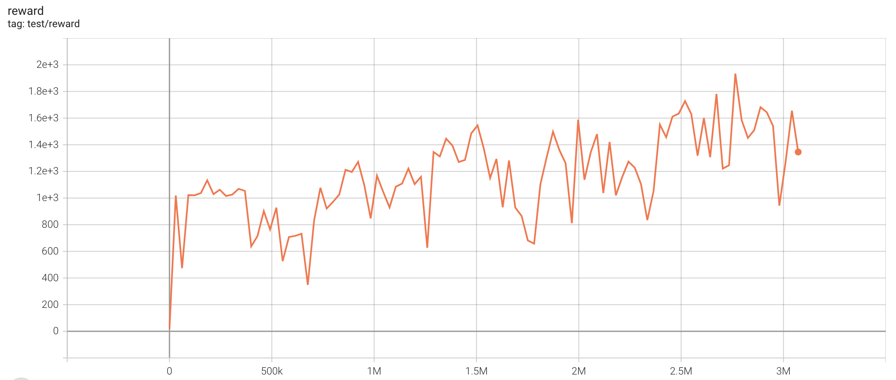
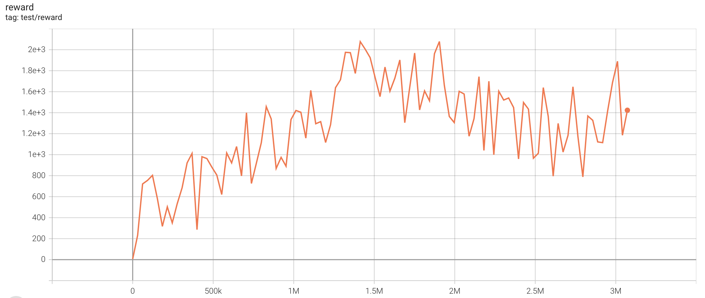

# Inverse Reinforcement Learning

In inverse reinforcement learning setting, the agent learns a policy from interaction with an environment without reward and a fixed dataset which is collected with an expert policy.

## Continuous control

Once the dataset is collected, it will not be changed during training. We use [d4rl](https://github.com/rail-berkeley/d4rl) datasets to train agent for continuous control. You can refer to [d4rl](https://github.com/rail-berkeley/d4rl) to see how to use d4rl datasets. 

We provide implementation of GAIL algorithm for continuous control.

### Train

You can parse d4rl datasets into a `ReplayBuffer` , and set it as the parameter `expert_buffer` of `GAILPolicy`.  `irl_gail.py` is an example of inverse RL using the d4rl dataset.

To train an agent with BCQ algorithm:

```bash
python irl_gail.py --task HalfCheetah-v2 --expert-data-task halfcheetah-expert-v2
```

## GAIL (single run)

| task                        | best reward | reward curve                          | parameters                                                   |
| --------------------------- | ----------- | ------------------------------------- | ------------------------------------------------------------ |
| HalfCheetah-v2     | 5177.07        |          | `python3 irl_gail.py --task "HalfCheetah-v2" --expert-data-task "halfcheetah-expert-v2"` |
| Hopper-v2          | 1761.44        |      | `python3 irl_gail.py --task "Hopper-v2" --expert-data-task "hopper-expert-v2"` |
| Walker2d-v2        | 2020.77        |        | `python3 irl_gail.py --task "Walker2d-v2" --expert-data-task "walker2d-expert-v2"`  |
