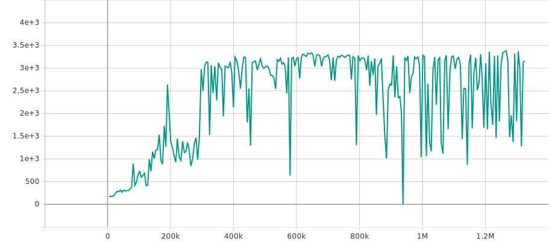
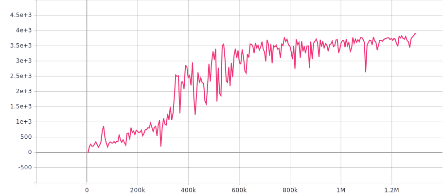
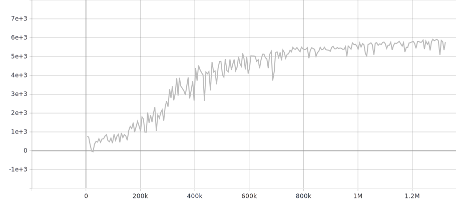
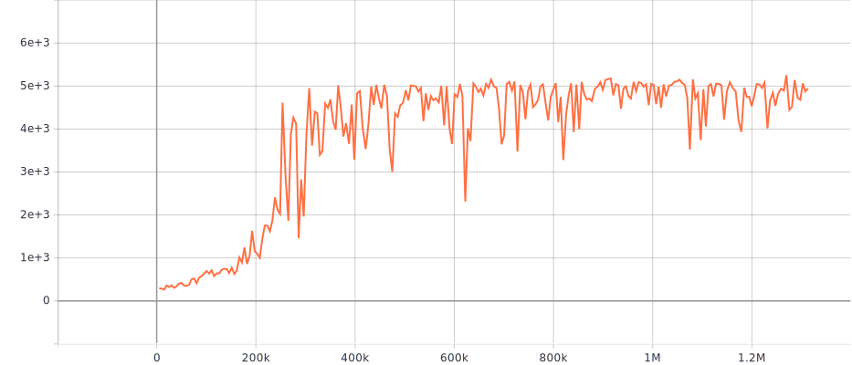
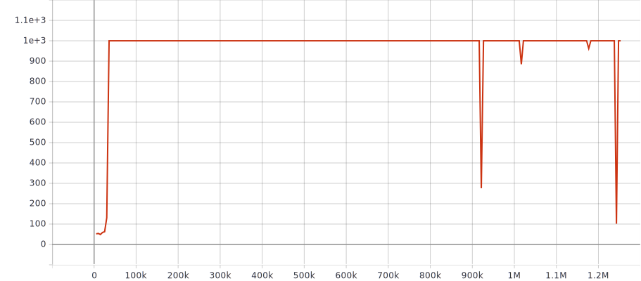
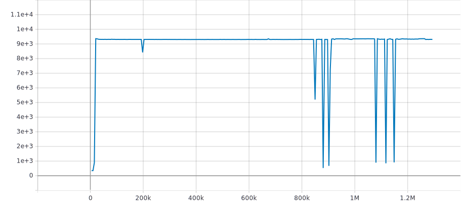
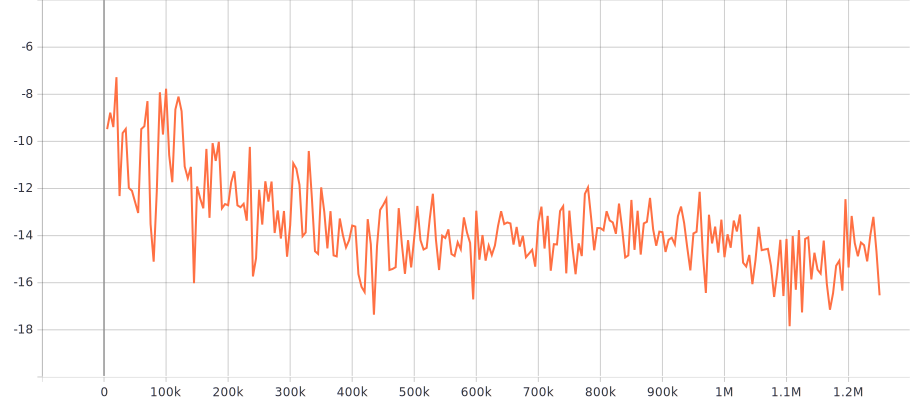

# Mujoco General

## DDPG
TBD

## TD3 (single run, seed=0)

For TD3 algorithm, we try to let our parameters be consistent with [Github: TD3](https://github.com/sfujim/TD3). However, evaluations below only report max of rewards over 1 trail(1M steps) using a fixed seed 0, where each reward represents average return over 10 episodes with no exploration noise. Parameter configuration can be found at td3_experiments.sh.
| task                        | best reward | reward curve (statistics after 1M steps are not used)                        | time cost |
| --------------------------- | ----------- | ---------------------------------------------------------------------------- | --------- |
| HalfCheetah-v3              | 8013        |                                          | ~3.5h     |
| Hopper-v3                   | 3281        |                                               | ~3.5h     |
| Walker2d-v3                 | 3668        |                                             | ~3.5h     |
| Ant-v3                      | 5727        |                                                  | ~4h       |
| Humanoid-v3                 | 5149        |                                             | ~4.5h     |
| InvertedPendulum-v2         | 2088        |                                     | ~3.5h     |
| InvertedDoublePendulum-v2   | 2088        |                                   | ~3.5h     |
| Reacher-v2                  | -7.3        |                                              | ~3.5h     |

## SAC (single run)

The best reward computes from 100 episodes returns in the test phase.

SAC on Swimmer-v3 always stops at 47\~48.

| task           | 3M best reward    | parameters                                              | time cost (3M) |
| -------------- | ----------------- | ------------------------------------------------------- | -------------- |
| HalfCheetah-v3 | 10157.70 ± 171.70 | `python3 mujoco_sac.py --task HalfCheetah-v3`           | 2~3h           |
| Walker2d-v3    | 5143.04 ± 15.57   | `python3 mujoco_sac.py --task Walker2d-v3`              | 2~3h           |
| Hopper-v3      | 3604.19 ± 169.55  | `python3 mujoco_sac.py --task Hopper-v3`                | 2~3h           |
| Humanoid-v3    | 6579.20 ± 1470.57 | `python3 mujoco_sac.py --task Humanoid-v3 --alpha 0.05` | 2~3h           |
| Ant-v3         | 6281.65 ± 686.28  | `python3 mujoco_sac.py --task Ant-v3`                   | 2~3h           |

### Which parts are important?

0. DO NOT share the same network with two critic networks.
1. The sigma (of the Gaussian policy) MUST be conditioned on input.
2. The network size should not be less than 256.
3. The deterministic evaluation helps a lot :)
