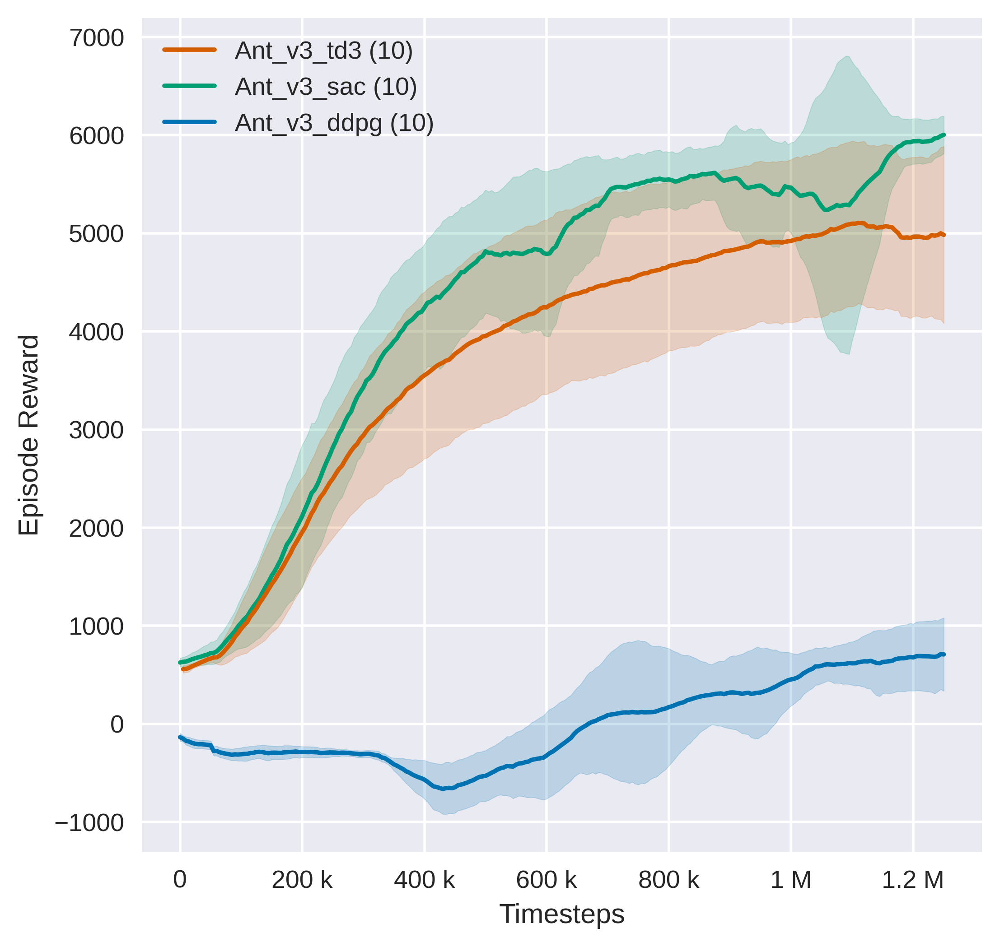

# Tianshou's Mujoco Benchmark

We benchmarked Tianshou algorithm implementations in 9 out of 13 environments from the MuJoCo Gym task suite<sup>[[1]](#footnote1)</sup>.

For each supported algorithm and supported mujoco environments, we provide:
- Default hyperparameters used for benchmark and scripts to reproduce the benchmark;
- A comparison of performance (or code level details) with other open source implementations or classic papers;
- Graphs and raw data that can be used for research purposes<sup>[[2]](#footnote2)</sup>;
- Log details obtained during training<sup>[[2]](#footnote2)</sup>;
- Pretrained agents<sup>[[2]](#footnote2)</sup>;
- Some hints on how to tune the algorithm.
  

Supported algorithms are listed below:
- [Deep Deterministic Policy Gradient (DDPG)](https://arxiv.org/pdf/1509.02971.pdf), [commit id](https://github.com/thu-ml/tianshou/tree/e605bdea942b408126ef4fbc740359773259c9ec)
- [Twin Delayed DDPG (TD3)](https://arxiv.org/pdf/1802.09477.pdf), [commit id](https://github.com/thu-ml/tianshou/tree/e605bdea942b408126ef4fbc740359773259c9ec)
- [Soft Actor-Critic (SAC)](https://arxiv.org/pdf/1812.05905.pdf), [commit id](https://github.com/thu-ml/tianshou/tree/e605bdea942b408126ef4fbc740359773259c9ec)
- [REINFORCE algorithm](https://papers.nips.cc/paper/1999/file/464d828b85b0bed98e80ade0a5c43b0f-Paper.pdf), [commit id](https://github.com/thu-ml/tianshou/tree/e27b5a26f330de446fe15388bf81c3777f024fb9)
- [Natural Policy Gradient](https://proceedings.neurips.cc/paper/2001/file/4b86abe48d358ecf194c56c69108433e-Paper.pdf), [commit id](https://github.com/thu-ml/tianshou/tree/844d7703c313009c4c364edb4018c91de93439ca)
- [Advantage Actor-Critic (A2C)](https://openai.com/blog/baselines-acktr-a2c/), [commit id](https://github.com/thu-ml/tianshou/tree/1730a9008ad6bb67cac3b21347bed33b532b17bc)
- [Proximal Policy Optimization (PPO)](https://arxiv.org/pdf/1707.06347.pdf), [commit id](https://github.com/thu-ml/tianshou/tree/6426a39796db052bafb7cabe85c764db20a722b0)
- [Trust Region Policy Optimization (TRPO)](https://arxiv.org/pdf/1502.05477.pdf), [commit id](https://github.com/thu-ml/tianshou/tree/5057b5c89e6168220272c9c28a15b758a72efc32)
- [Hindsight Experience Replay (HER)](https://arxiv.org/abs/1707.01495)

## EnvPool

We highly recommend using envpool to run the following experiments. To install, in a linux machine, type:

```bash
pip install envpool
```

After that, `make_mujoco_env` will automatically switch to envpool's Mujoco env. EnvPool's implementation is much faster (about 2\~3x faster for pure execution speed, 1.5x for overall RL training pipeline in average) than python vectorized env implementation, and it's behavior is consistent to gym's Mujoco env.

For more information, please refer to EnvPool's [GitHub](https://github.com/sail-sg/envpool/) and [Docs](https://envpool.readthedocs.io/en/latest/api/mujoco.html).

## Usage

Run

```bash
$ python mujoco_sac.py --task Ant-v3
```

Logs is saved in `./log/` and can be monitored with tensorboard.

```bash
$ tensorboard --logdir log
```

You can also reproduce the benchmark (e.g. SAC in Ant-v3) with the example script we provide under `examples/mujoco/`:

```bash
$ ./run_experiments.sh Ant-v3 sac
```

This will start 10 experiments with different seeds.

Now that all the experiments are finished, we can convert all tfevent files into csv files and then try plotting the results.

```bash
# generate csv
$ ./tools.py --root-dir ./results/Ant-v3/sac
# generate figures
$ ./plotter.py --root-dir ./results/Ant-v3 --shaded-std --legend-pattern "\\w+"
# generate numerical result (support multiple groups: `--root-dir ./` instead of single dir)
$ ./analysis.py --root-dir ./results --norm
```

## Example benchmark



Other graphs can be found under `examples/mujuco/benchmark/`

For pretrained agents, detailed graphs (single agent, single game) and log details, please refer to [https://cloud.tsinghua.edu.cn/d/f45fcfc5016043bc8fbc/](https://cloud.tsinghua.edu.cn/d/f45fcfc5016043bc8fbc/).

## Offpolicy algorithms

#### Notes

1. In offpolicy algorithms (DDPG, TD3, SAC), the shared hyperparameters are almost the same, and unless otherwise stated, hyperparameters are consistent with those used for benchmark in SpinningUp's implementations (e.g. we use batchsize 256 in DDPG/TD3/SAC while SpinningUp use 100. Minor difference also lies with `start-timesteps`, data loop method `step_per_collect`, method to deal with/bootstrap truncated steps because of timelimit and unfinished/collecting episodes (contribute to performance improvement), etc.).
2. By comparison to both classic literature and open source implementations (e.g., SpinningUp)<sup>[[1]](#footnote1)</sup><sup>[[2]](#footnote2)</sup>, Tianshou's implementations of DDPG, TD3, and SAC are roughly at-parity with or better than the best reported results for these algorithms, so you can definitely use Tianshou's benchmark for research purposes.
3. We didn't compare offpolicy algorithms to OpenAI baselines [benchmark](https://github.com/openai/baselines/blob/master/benchmarks_mujoco1M.htm), because for now it seems that they haven't provided benchmark for offpolicy algorithms, but in [SpinningUp docs](https://spinningup.openai.com/en/latest/spinningup/bench.html) they stated that "SpinningUp implementations of DDPG, TD3, and SAC are roughly at-parity with the best-reported results for these algorithms", so we think lack of comparisons with OpenAI baselines is okay.

### DDPG

|      Environment       |   Tianshou (1M)   | [Spinning Up (PyTorch)](https://spinningup.openai.com/en/latest/spinningup/bench.html) | [TD3 paper (DDPG)](https://arxiv.org/abs/1802.09477) | [TD3 paper (OurDDPG)](https://arxiv.org/abs/1802.09477) |
| :--------------------: | :---------------: | :----------------------------------------------------------: | :--------------------------------------------------: | :-----------------------------------------------------: |
|          Ant           |     990.4±4.3     |                             ~840                             |                      **1005.3**                      |                          888.8                          |
|      HalfCheetah       | **11718.7±465.6** |                            ~11000                            |                        3305.6                        |                         8577.3                          |
|         Hopper         | **2197.0±971.6**  |                            ~1800                             |                      **2020.5**                      |                         1860.0                          |
|        Walker2d        |   1400.6±905.0    |                            ~1950                             |                        1843.6                        |                       **3098.1**                        |
|        Swimmer         |   **144.1±6.5**   |                             ~137                             |                          N                           |                            N                            |
|        Humanoid        |  **177.3±77.6**   |                              N                               |                          N                           |                            N                            |
|        Reacher         |   **-3.3±0.3**    |                              N                               |                        -6.51                         |                          -4.01                          |
|    InvertedPendulum    |  **1000.0±0.0**   |                              N                               |                      **1000.0**                      |                       **1000.0**                        |
| InvertedDoublePendulum |   8364.3±2778.9   |                              N                               |                      **9355.5**                      |                         8370.0                          |

\* details<sup>[[4]](#footnote4)</sup><sup>[[5]](#footnote5)</sup><sup>[[6]](#footnote6)</sup>

### TD3

|      Environment       |   Tianshou (1M)   | [Spinning Up (PyTorch)](https://spinningup.openai.com/en/latest/spinningup/bench.html) | [TD3 paper](https://arxiv.org/abs/1802.09477) |
| :--------------------: | :---------------: | :----------------------------------------------------------: | :-------------------------------------------: |
|          Ant           | **5116.4±799.9**  |                            ~3800                             |                 4372.4±1000.3                 |
|      HalfCheetah       | **10201.2±772.8** |                            ~9750                             |                 9637.0±859.1                  |
|         Hopper         |   3472.2±116.8    |                            ~2860                             |               **3564.1±114.7**                |
|        Walker2d        |   3982.4±274.5    |                            ~4000                             |               **4682.8±539.6**                |
|        Swimmer         |  **104.2±34.2**   |                             ~78                              |                       N                       |
|        Humanoid        | **5189.5±178.5**  |                              N                               |                       N                       |
|        Reacher         |   **-2.7±0.2**    |                              N                               |                   -3.6±0.6                    |
|    InvertedPendulum    |  **1000.0±0.0**   |                              N                               |                **1000.0±0.0**                 |
| InvertedDoublePendulum |  **9349.2±14.3**  |                              N                               |                **9337.5±15.0**                |

\* details<sup>[[4]](#footnote4)</sup><sup>[[5]](#footnote5)</sup><sup>[[6]](#footnote6)</sup>

#### Hints for TD3
1. TD3's learning rate is set to 3e-4 while it is 1e-3 for DDPG/SAC. However, there is NO enough evidence to support our choice of such hyperparameters (we simply choose them because SpinningUp do so) and you can try playing with those hyperparameters to see if you can improve performance. Do tell us if you can!

### SAC

|      Environment       |   Tianshou (1M)    | [Spinning Up (PyTorch)](https://spinningup.openai.com/en/latest/spinningup/bench.html) | [SAC paper](https://arxiv.org/abs/1801.01290) |
| :--------------------: | :----------------: | :----------------------------------------------------------: | :-------------------------------------------: |
|          Ant           |  **5850.2±475.7**  |                            ~3980                             |                     ~3720                     |
|      HalfCheetah       | **12138.8±1049.3** |                            ~11520                            |                    ~10400                     |
|         Hopper         |  **3542.2±51.5**   |                            ~3150                             |                     ~3370                     |
|        Walker2d        |  **5007.0±251.5**  |                            ~4250                             |                     ~3740                     |
|        Swimmer         |    **44.4±0.5**    |                            ~41.7                             |                       N                       |
|        Humanoid        |  **5488.5±81.2**   |                              N                               |                     ~5200                     |
|        Reacher         |    **-2.6±0.2**    |                              N                               |                       N                       |
|    InvertedPendulum    |   **1000.0±0.0**   |                              N                               |                       N                       |
| InvertedDoublePendulum |   **9359.5±0.4**   |                              N                               |                       N                       |

\* details<sup>[[4]](#footnote4)</sup><sup>[[5]](#footnote5)</sup>

#### Hints for SAC
1. SAC's start-timesteps is set to 10000 by default while it is 25000 is DDPG/TD3. However, there is NO enough evidence to support our choice of such hyperparameters (we simply choose them because SpinningUp do so) and you can try playing with those hyperparameters to see if you can improve performance. Do tell us if you can!
2. DO NOT share the same network with two critic networks.
3. The sigma (of the Gaussian policy) should be conditioned on input.
4. The deterministic evaluation helps a lot :)

## Onpolicy Algorithms

#### Notes
1. In A2C and PPO, unless otherwise stated, most hyperparameters are consistent with those used for benchmark in [ikostrikov/pytorch-a2c-ppo-acktr-gail](https://github.com/ikostrikov/pytorch-a2c-ppo-acktr-gail).
2. Gernally speaking, by comparison to both classic literature and open source implementations (e.g., OPENAI Baselines)<sup>[[1]](#footnote1)</sup><sup>[[2]](#footnote2)</sup>, Tianshou's implementations of REINFORCE, A2C, PPO are better than the best reported results for these algorithms, so you can definitely use Tianshou's benchmark for research purposes.

### REINFORCE

|      Environment       |  Tianshou (10M)   |
| :--------------------: | :---------------: |
|          Ant           | **1108.1±323.1**  |
|      HalfCheetah       | **1138.8±104.7**  |
|         Hopper         |  **416.0±104.7**  |
|        Walker2d        |  **440.9±148.2**  |
|        Swimmer         |   **35.6±2.6**    |
|        Humanoid        |  **464.3±58.4**   |
|        Reacher         |   **-5.5±0.2**    |
|    InvertedPendulum    |  **1000.0±0.0**   |
| InvertedDoublePendulum | **7726.2±1287.3** |


|      Environment       |   Tianshou (3M)   | [Spinning Up (VPG PyTorch)](https://spinningup.openai.com/en/latest/spinningup/bench_vpg.html)<sup>[[7]](#footnote7)</sup> |
| :--------------------: | :---------------: | :----------------------------------------------------------: |
|          Ant           | **474.9+-133.5**  |                              ~5                              |
|      HalfCheetah       |  **884.0+-41.0**  |                             ~600                             |
|         Hopper         |   395.8+-64.5*    |                           **~800**                           |
|        Walker2d        |    412.0+-52.4    |                           **~460**                           |
|        Swimmer         |     35.3+-1.4     |                           **~51**                            |
|        Humanoid        |  **438.2+-47.8**  |                              N                               |
|        Reacher         |  **-10.5+-0.7**   |                              N                               |
|    InvertedPendulum    |  **999.2+-2.4**   |                              N                               |
| InvertedDoublePendulum | **1059.7+-307.7** |                              N                               |

\* details<sup>[[4]](#footnote4)</sup><sup>[[5]](#footnote5)</sup>

#### Hints for REINFORCE

1. Following [Andrychowicz, Marcin, et al](https://arxiv.org/abs/2006.05990), we downscale last layer of policy network by a factor of 0.01 after orthogonal initialization.
2. We choose "tanh" function to squash sampled action from range (-inf, inf) to (-1, 1) rather than usually used clipping method (As in StableBaselines3). We did full scale ablation studies and results show that tanh squashing performs a tiny little bit better than clipping overall, and is much better than no action bounding. However, "clip" method is still a very good method, considering its simplicity.
3. We use global observation normalization and global rew-to-go (value) normalization by default. Both are crucial to good performance of REINFORCE algorithm. Since we minus mean when doing rew-to-go normalization, you can treat global mean of rew-to-go as a naive version of "baseline".
4. Since we do not have a value estimator, we use global rew-to-go mean to bootstrap truncated steps because of timelimit and unfinished collecting, while most other implementations use 0. We feel this would help because mean is more likely a better estimate than 0 (no ablation study has been done).
5. We have done full scale ablation study on learning rate and lr decay strategy. We experiment with lr of 3e-4, 5e-4, 1e-3, each have 2 options: no lr decay or linear decay to 0. Experiments show that 3e-4 learning rate will cause slowly learning and make agent step in local optima easily for certain environments like InvertedDoublePendulum, Ant, HalfCheetah, and 1e-3 lr helps a lot. However, after training agents with lr 1e-3 for 5M steps or so, agents in certain environments like InvertedPendulum will become unstable. Conclusion is that we should start with a large learning rate and linearly decay it, but for a small initial learning rate or if you only train agents for limited timesteps, DO NOT decay it.
6. We didn't tune `step-per-collect` option and `training-num` option. Default values are finetuned with PPO algorithm so we assume they are also good for REINFORCE. You can play with them if you want, but remember that `buffer-size` should always be larger than `step-per-collect`, and if `step-per-collect` is too small and `training-num` too large, episodes will be truncated and bootstrapped very often, which will harm performance. If `training-num` is too small (e.g., less than 8), speed will go down.
7. Sigma of action is not fixed (normally seen in other implementation) or conditioned on observation, but is an independent parameter which can be updated by gradient descent. We choose this setting because it works well in PPO, and is recommended by [Andrychowicz, Marcin, et al](https://arxiv.org/abs/2006.05990). See Fig. 23.

### A2C

|      Environment       |   Tianshou (3M)    | [Spinning Up (PyTorch)](https://spinningup.openai.com/en/latest/spinningup/bench_vpg.html) |
| :--------------------: | :----------------: | :----------------------------------------------------------: |
|          Ant           | **5236.8+-236.7**  |                              ~5                              |
|      HalfCheetah       | **2377.3+-1363.7** |                             ~600                             |
|         Hopper         | **1608.6+-529.5**  |                             ~800                             |
|        Walker2d        | **1805.4+-1055.9** |                             ~460                             |
|        Swimmer         |     40.2+-1.8      |                           **~51**                            |
|        Humanoid        | **5316.6+-554.8**  |                              N                               |
|        Reacher         |   **-5.2+-0.5**    |                              N                               |
|    InvertedPendulum    |  **1000.0+-0.0**   |                              N                               |
| InvertedDoublePendulum |  **9351.3+-12.8**  |                              N                               |

|      Environment       |   Tianshou (1M)    | [PPO paper](https://arxiv.org/abs/1707.06347) A2C | [PPO paper](https://arxiv.org/abs/1707.06347) A2C + Trust Region |
| :--------------------: | :----------------: | :-----------------------------------------------: | :----------------------------------------------------------: |
|          Ant           | **3485.4+-433.1**  |                         N                         |                              N                               |
|      HalfCheetah       | **1829.9+-1068.3** |                       ~1000                       |                             ~930                             |
|         Hopper         | **1253.2+-458.0**  |                       ~900                        |                            ~1220                             |
|        Walker2d        | **1091.6+-709.2**  |                       ~850                        |                             ~700                             |
|        Swimmer         |   **36.6+-2.1**    |                        ~31                        |                           **~36**                            |
|        Humanoid        | **1726.0+-1070.1** |                         N                         |                              N                               |
|        Reacher         |   **-6.7+-2.3**    |                       ~-24                        |                             ~-27                             |
|    InvertedPendulum    |  **1000.0+-0.0**   |                     **~1000**                     |                          **~1000**                           |
| InvertedDoublePendulum | **9257.7+-277.4**  |                       ~7100                       |                            ~8100                             |

\* details<sup>[[4]](#footnote4)</sup><sup>[[5]](#footnote5)</sup>

#### Hints for A2C

1. We choose `clip` action method in A2C instead of `tanh` option as used in REINFORCE simply to be consistent with original implementation. `tanh` may be better or equally well but we didn't have a try.
2. (Initial) learning rate, lr\_decay, `step-per-collect` and `training-num` affect the performance of A2C to a great extend. These 4 hyperparameters also affect each other and should be tuned together. We have done full scale ablation studies on these 4 hyperparameters (more than 800 agents have been trained). Below are our findings.
3. `step-per-collect` / `training-num` are equal to `bootstrap-lenghth`, which is the max length of an "episode" used in GAE estimator and 80/16=5 in default settings. When `bootstrap-lenghth` is small, (maybe) because GAE can look forward at most 5 steps and use bootstrap strategy very often, the critic is less well-trained leading the actor to a not very high score. However, if we increase `step-per-collect` to increase `bootstrap-lenghth` (e.g. 256/16=16), actor/critic will be updated less often, resulting in low sample efficiency and slow training process. To conclude, If you don't restrict env timesteps, you can try using larger `bootstrap-lenghth` and train with more steps to get a better converged score. Train slower, achieve higher.
4. The learning rate 7e-4 with decay strategy is appropriate for `step-per-collect=80` and `training-num=16`. But if you use a larger `step-per-collect`(e.g. 256 - 2048), 7e-4 is a little bit small for `lr` because each update will have more data, less noise and thus smaller deviation in this case. So it is more appropriate to use a higher learning rate (e.g. 1e-3) to boost performance in this setting. If plotting results arise fast in early stages and become unstable later, consider lr decay first before decreasing lr.
5. `max-grad-norm` didn't really help in our experiments. We simply keep it for consistency with other open-source implementations (e.g. SB3).
6. Although original paper of A3C uses RMSprop optimizer, we found that Adam with the same learning rate worked equally well. We use RMSprop anyway. Again, for consistency.
7. We noticed that the implementation of A2C in SB3 sets `gae-lambda` to 1 by default for no reason, and our experiments showed better results overall when `gae-lambda` was set to 0.95.
8. We found out that `step-per-collect=256` and `training-num=8` are also good settings. You can have a try.

### PPO

|      Environment       |   Tianshou (1M)    | [ikostrikov/pytorch-a2c-ppo-acktr-gail](https://github.com/ikostrikov/pytorch-a2c-ppo-acktr-gail) | [PPO paper](https://arxiv.org/pdf/1707.06347.pdf) | [OpenAI Baselines](https://github.com/openai/baselines/blob/master/benchmarks_mujoco1M.htm) | [Spinning Up (PyTorch)](https://spinningup.openai.com/en/latest/spinningup/bench_ppo.html) |
| :--------------------: | :----------------: | :----------------------------------------------------------: | :-----------------------------------------------: | :----------------------------------------------------------: | :----------------------------------------------------------: |
|          Ant           | **3258.4+-1079.3** |                              N                               |                         N                         |                              N                               |                             ~650                             |
|      HalfCheetah       | **5783.9+-1244.0** |                            ~3120                             |                       ~1800                       |                            ~1700                             |                            ~1670                             |
|         Hopper         | **2609.3+-700.8**  |                            ~2300                             |                       ~2330                       |                            ~2400                             |                            ~1850                             |
|        Walker2d        |   3588.5+-756.6    |                          **~4000**                           |                       ~3460                       |                            ~3510                             |                            ~1230                             |
|        Swimmer         |     66.7+-99.1     |                              N                               |                       ~108                        |                             ~111                             |                           **~120**                           |
|        Humanoid        |  **787.1+-193.5**  |                              N                               |                         N                         |                              N                               |                              N                               |
|        Reacher         |   **-4.1+-0.3**    |                             ~-5                              |                        ~-7                        |                             ~-6                              |                              N                               |
|    InvertedPendulum    |  **1000.0+-0.0**   |                              N                               |                     **~1000**                     |                             ~940                             |                              N                               |
| InvertedDoublePendulum | **9231.3+-270.4**  |                              N                               |                       ~8000                       |                            ~7350                             |                              N                               |

|      Environment       |   Tianshou (3M)    | [Spinning Up (PyTorch)](https://spinningup.openai.com/en/latest/spinningup/bench_ppo.html) |
| :--------------------: | :----------------: | :----------------------------------------------------------: |
|          Ant           | **4079.3+-880.2**  |                            ~3000                             |
|      HalfCheetah       | **7337.4+-1508.2** |                            ~3130                             |
|         Hopper         | **3127.7+-413.0**  |                            ~2460                             |
|        Walker2d        | **4895.6+-704.3**  |                            ~2600                             |
|        Swimmer         |     81.4+-96.0     |                           **~120**                           |
|        Humanoid        | **1359.7+-572.7**  |                              N                               |
|        Reacher         |   **-3.7+-0.3**    |                              N                               |
|    InvertedPendulum    |  **1000.0+-0.0**   |                              N                               |
| InvertedDoublePendulum | **9231.3+-270.4**  |                              N                               |

\* details<sup>[[4]](#footnote4)</sup><sup>[[5]](#footnote5)</sup>

#### Hints for PPO
1. Following [Andrychowicz, Marcin, et al](https://arxiv.org/abs/2006.05990) Sec 3.5, we use "recompute advantage" strategy, which contributes a lot to our SOTA benchmark. However, I personally don't quite agree with their explanation about why "recompute advantage" helps. They stated that it's because old strategy "makes it impossible to compute advantages as the temporal structure is broken", but PPO's update equation is designed to learn from slightly-outdated advantages. I think the only reason "recompute advantage" works is that it update the critic several times rather than just one time per update, which leads to a better value function estimation.
2. We have done full scale ablation studies of PPO algorithm's hyperparameters. Here are our findings: In Mujoco settings, `value-clip` and `norm-adv` may help a litte bit in some games (e.g. `norm-adv` helps stabilize training in InvertedPendulum-v2), but they make no difference to overall performance. So in our benchmark we do not use such tricks. We validate that setting `ent-coef` to 0.0 rather than 0.01 will increase overall performance in mujoco environments. `max-grad-norm` still offers no help for PPO algorithm, but we still keep it for consistency.
3. [Andrychowicz, Marcin, et al](https://arxiv.org/abs/2006.05990)'s work indicates that using `gae-lambda` 0.9 and changing policy network's width based on which game you play (e.g. use [16, 16] `hidden-sizes` for `actor` network in HalfCheetah and [256, 256] for Ant) may help boost performance. Our ablation studies say otherwise: both options may lead to equal or lower performance overall in our experiments. We are not confident about this claim because we didn't change learning rate and other maybe-correlated factors in our experiments. So if you want, you can still have a try.
4. `batch-size` 128 and 64 (default) work equally well. Changing `training-num` alone slightly (maybe in range [8, 128]) won't affect performance. For bound action method, both `clip` and `tanh` work quite well. 
5. In OPENAI implementations of PPO, they multiply value loss with a factor of 0.5 for no good reason (see this [issue](https://github.com/openai/baselines/issues/445#issuecomment-777988738)). We do not do so and therefore make our `vf-coef` 0.25 (half of standard 0.5). However, since value loss is only used to optimize `critic` network, setting different `vf-coef` should in theory make no difference if using Adam optimizer.
   
### TRPO

|      Environment       |   Tianshou (1M)   | [ACKTR paper](https://arxiv.org/pdf/1708.05144.pdf) | [PPO paper](https://arxiv.org/pdf/1707.06347.pdf) | [OpenAI Baselines](https://github.com/openai/baselines/blob/master/benchmarks_mujoco1M.htm) | [Spinning Up (Tensorflow)](https://spinningup.openai.com/en/latest/spinningup/bench.html) |
| :--------------------: | :---------------: | :-------------------------------------------------: | :-----------------------------------------------: | :----------------------------------------------------------: | :----------------------------------------------------------: |
|          Ant           | **2866.7±707.9**  |                         ~0                          |                         N                         |                              N                               |                             ~150                             |
|      HalfCheetah       | **4471.2±804.9**  |                        ~400                         |                        ~0                         |                            ~1350                             |                             ~850                             |
|         Hopper         |   2046.0±1037.9   |                        ~1400                        |                       ~2100                       |                          **~2200**                           |                            ~1200                             |
|        Walker2d        | **3826.7±782.7**  |                        ~550                         |                       ~1100                       |                            ~2350                             |                             ~600                             |
|        Swimmer         |     40.9±19.6     |                         ~40                         |                     **~121**                      |                             ~95                              |                             ~85                              |
|        Humanoid        |  **810.1±126.1**  |                          N                          |                         N                         |                              N                               |                              N                               |
|        Reacher         |   **-5.1±0.8**    |                         -8                          |                       ~-115                       |                           **~-5**                            |                              N                               |
|    InvertedPendulum    |  **1000.0±0.0**   |                      **~1000**                      |                     **~1000**                     |                             ~910                             |                              N                               |
| InvertedDoublePendulum | **8435.2±1073.3** |                        ~800                         |                       ~200                        |                            ~7000                             |                              N                               |

\* details<sup>[[4]](#footnote4)</sup><sup>[[5]](#footnote5)</sup>

#### Hints for TRPO
1. We have tried `step-per-collect` in (80, 1024, 2048, 4096), and `training-num` in (4, 16, 32, 64), and found out 1024 for `step-per-collect` (same as OpenAI Baselines) and smaller `training-num` (below 16) are good choices. Set `training-num` to 4 is actually better but we still use 16 considering the boost of training speed.
2. Advantage normalization is a standard trick in TRPO, but we found it of minor help, just like in PPO.
3. Larger `optim-critic-iters` (than 5, as used in OpenAI Baselines) helps in most environments. Smaller lr and lr\_decay strategy also help a tiny little bit for performance.
4. `gae-lambda` 0.98 and 0.95 work equally well.
5. We use GAE returns (GAE advantage + value) as the target of critic network when updating, while people usually tend to use reward to go (lambda = 0.) as target. We found that they work equally well although using GAE returns is a little bit inaccurate (biased) by math.
6. Empirically, Swimmer-v3 usually requires larger bootstrap lengths and learning rate. Humanoid-v3 and InvertedPendulum-v2, however, are on the opposite.
7. In contrast, with the statement made in TRPO paper, we found that backtracking in line search is rarely used at least in Mujoco settings, which is actually unimportant. This makes TRPO algorithm actually the same as TNPG algorithm (described in this [paper](http://proceedings.mlr.press/v48/duan16.html)). This also explains why TNPG and TRPO's plotting results look so similar in that paper.
8. "recompute advantage" is helpful in PPO but doesn't help in TRPO.

### NPG

|      Environment       |  Tianshou (1M)   |
| :--------------------: | :--------------: |
|          Ant           | **2358.0±517.5** |
|      HalfCheetah       | **3485.2±716.6** |
|         Hopper         | **1915.2±550.5** |
|        Walker2d        | **2503.2±963.3** |
|        Swimmer         |   **31.5±8.0**   |
|        Humanoid        |  **765.1±91.3**  |
|        Reacher         |   **-4.5±0.5**   |
|    InvertedPendulum    |  **1000.0±0.0**  |
| InvertedDoublePendulum | **9243.2±276.0** |

\* details<sup>[[4]](#footnote4)</sup><sup>[[5]](#footnote5)</sup>

#### Hints for NPG
1. All shared hyperparameters are exactly the same as TRPO, regarding how similar these two algorithms are.
2. We found different games in Mujoco may require quite different `actor-step-size`: Reacher/Swimmer are insensitive to step-size in range (0.1~1.0), while InvertedDoublePendulum / InvertedPendulum / Humanoid are quite sensitive to step size, and even 0.1 is too large. Other games may require `actor-step-size` in range (0.1~0.4), but aren't that sensitive in general.

## Others

### HER
|      Environment       |  DDPG without HER  |   DDPG with HER    |
| :--------------------: |  :--------------:  |  :--------------:  |
|       FetchReach       |     -49.9±0.2.     |   **-17.6±21.7**   |

#### Hints for HER
1. The HER technique is proposed for solving task-based environments, so it cannot be compared with non-task-based mujoco benchmarks. The environment used in this evaluation is ``FetchReach-v3`` which requires an extra [installation](https://github.com/Farama-Foundation/Gymnasium-Robotics).
2. Simple hyperparameters optimizations are done for both settings, DDPG with and without HER. However, since *DDPG without HER* failed in every experiment, the best hyperparameters for *DDPG with HER* are used in the evaluation of both settings.
3. The scores are the mean reward ± 1 standard deviation of 16 seeds. The minimum reward for ``FetchReach-v3`` is -50 which we can imply that *DDPG without HER* performs as good as a random policy. *DDPG with HER* although has a better mean reward, the standard deviation is quite high. This is because in this setting, the agent will either fail completely (-50 reward) or successfully learn the task (close to 0 reward). This means that the agent successfully learned in about 70% of the 16 seeds.

## Note

<a name="footnote1">[1]</a>  Supported environments include HalfCheetah-v3, Hopper-v3, Swimmer-v3, Walker2d-v3, Ant-v3, Humanoid-v3, Reacher-v2, InvertedPendulum-v2 and InvertedDoublePendulum-v2. Pusher, Thrower, Striker and HumanoidStandup are not supported because they are not commonly seen in literatures.

<a name="footnote2">[2]</a>  Pretrained agents, detailed graphs (single agent, single game) and log details can all be found at [Google Drive](https://drive.google.com/drive/folders/1IycImzTmWcyEeD38viea5JHoboC4zmNP?usp=share_link).

<a name="footnote3">[3]</a>  We used the latest version of all mujoco environments in gym (0.17.3 with mujoco==2.0.2.13), but it's not often the case with other benchmarks. Please check for details yourself in the original paper. (Different version's outcomes are usually similar, though)

<a name="footnote4">[4]</a>  ~ means the number is approximated from the graph because accurate numbers is not provided in the paper. N means graphs not provided.

<a name="footnote5">[5]</a>  Reward metric: The meaning of the table value is the max average return over 10 trails (different seeds) ± a single standard deviation over trails. Each trial is averaged on another 10 test seeds. Only the first 1M steps data will be considered, if not otherwise stated. The shaded region on the graph also represents a single standard deviation. It is the same as [TD3 evaluation method](https://github.com/sfujim/TD3/issues/34).

<a name="footnote6">[6]</a>  In TD3 paper, shaded region represents only half of standard deviation.

<a name="footnote7">[7]</a>  Comparing Tianshou's REINFORCE algorithm with SpinningUp's VPG is quite unfair because SpinningUp's VPG uses a generative advantage estimator (GAE) which requires a dnn value predictor (critic network), which makes so called "VPG" more like A2C (advantage actor critic) algorithm. Even so, you can see that we are roughly at-parity with each other even if tianshou's REINFORCE do not use a critic or GAE.
