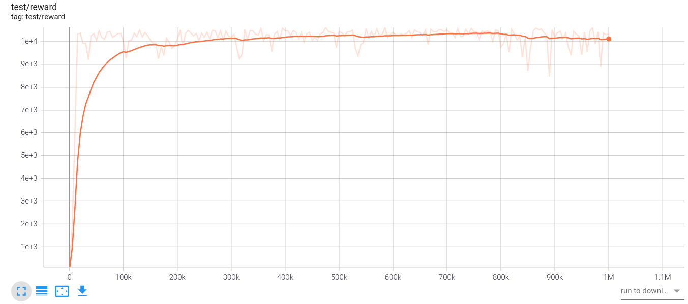

# Offline

In offline reinforcement learning setting, the agent learns a policy from a fixed dataset which is collected once with any policy. And the agent does not interact with environment anymore. 

## Continous control

Once the dataset is collected, it will not be changed during training. We use [d4rl](https://github.com/rail-berkeley/d4rl) datasets to train offline agent for continuous control. You can refer to [d4rl](https://github.com/rail-berkeley/d4rl) to see how to use d4rl datasets. 

### Train

Tianshou provides an `offline_trainer` for offline reinforcement learning. You can parse d4rl datasets into a `ReplayBuffer` , and set it as the parameter `buffer` of `offline_trainer`.  `offline_bcq.py` is an example of offline RL using the d4rl dataset.

To train an agent with BCQ algorithm:

```bash
python offline_bcq.py --task halfcheetah-expert-v1
```

After 1M steps:



`halfcheetah-expert-v1` is a mujoco environment. The setting of hyperparameters are similar to the offpolicy algorithms in mujoco environment.

## Results

| Environment           | BCQ             |
| --------------------- | --------------- |
| halfcheetah-expert-v1 | 10624.0 ± 181.4 |

## Discrete control

For discrete control, we currently use ad hoc Atari data generated from a trained QRDQN agent. In the future, we can switch to better benchmarks such as the Atari portion of [RL Unplugged](https://github.com/deepmind/deepmind-research/tree/master/rl_unplugged).

### Gather Data

To running CQL algorithm on Atari, you need to do the following things:

- Train an expert, by using the command listed in the QRDQN section of Atari examples: `python3 atari_qrdqn.py --task {your_task}`
- Generate buffer with noise: `python3 atari_qrdqn.py --task {your_task} --watch --resume-path log/{your_task}/qrdqn/policy.pth --eps-test 0.2 --buffer-size 1000000 --save-buffer-name expert.hdf5` (note that 1M Atari buffer cannot be saved as `.pkl` format because it is too large and will cause error);
- Train offline model: `python3 atari_{bcq,cql,crr}.py --task {your_task} --load-buffer-name expert.hdf5`.

### BCQ

We test our BCQ implementation on two example tasks (different from author's version, we use v4 instead of v0; one epoch means 10k gradient step):

| Task                   | Online QRDQN | Behavioral | BCQ                               | parameters                                                   |
| ---------------------- | ---------- | ---------- | --------------------------------- |  ------------------------------------------------------------ |
| PongNoFrameskip-v4     | 20.5       | 6.8        | 20.1 (epoch 5)                    | `python3 atari_bcq.py --task "PongNoFrameskip-v4" --load-buffer-name log/PongNoFrameskip-v4/qrdqn/expert.hdf5 --epoch 5` |
| BreakoutNoFrameskip-v4 | 394.3      | 46.9       | 64.6 (epoch 12, could be higher)  | `python3 atari_bcq.py --task "BreakoutNoFrameskip-v4" --load-buffer-name log/BreakoutNoFrameskip-v4/qrdqn/expert.hdf5 --epoch 12` |

### CQL

We test our CQL implementation on two example tasks (different from author's version, we use v4 instead of v0; one epoch means 10k gradient step):

| Task                   | Online QRDQN | Behavioral | CQL                               | parameters                                                   |
| ---------------------- | ---------- | ---------- | --------------------------------- | ------------------------------------------------------------ |
| PongNoFrameskip-v4     | 20.5         | 6.8        | 20.4 (epoch 5)                      | `python3 atari_cql.py --task "PongNoFrameskip-v4" --load-buffer-name log/PongNoFrameskip-v4/qrdqn/expert.hdf5 --epoch 5` |
| BreakoutNoFrameskip-v4 | 394.3        | 46.9       | 129.4 (epoch 12) | `python3 atari_cql.py --task "BreakoutNoFrameskip-v4" --load-buffer-name log/BreakoutNoFrameskip-v4/qrdqn/expert.hdf5 --epoch 12 --min-q-weight 50` |

We reduce the size of the offline data to 10% and 1% of the above and get:

Buffer size 100000:

| Task                   | Online QRDQN | Behavioral | CQL                               | parameters                                                   |
| ---------------------- | ---------- | ---------- | --------------------------------- | ------------------------------------------------------------ |
| PongNoFrameskip-v4     | 20.5         | 5.8        | 21 (epoch 5)                      | `python3 atari_cql.py --task "PongNoFrameskip-v4" --load-buffer-name log/PongNoFrameskip-v4/qrdqn/expert.size_1e5.hdf5 --epoch 5` |
| BreakoutNoFrameskip-v4 | 394.3        | 41.4       | 40.8 (epoch 12) | `python3 atari_cql.py --task "BreakoutNoFrameskip-v4" --load-buffer-name log/BreakoutNoFrameskip-v4/qrdqn/expert.size_1e5.hdf5 --epoch 12 --min-q-weight 20` |

Buffer size 10000:

| Task                   | Online QRDQN | Behavioral | CQL                               | parameters                                                   |
| ---------------------- | ---------- | ---------- | --------------------------------- | ------------------------------------------------------------ |
| PongNoFrameskip-v4     | 20.5         | nan        | 1.8 (epoch 5)                      | `python3 atari_cql.py --task "PongNoFrameskip-v4" --load-buffer-name log/PongNoFrameskip-v4/qrdqn/expert.size_1e4.hdf5 --epoch 5 --min-q-weight 1` |
| BreakoutNoFrameskip-v4 | 394.3        | 31.7       | 22.5 (epoch 12) | `python3 atari_cql.py --task "BreakoutNoFrameskip-v4" --load-buffer-name log/BreakoutNoFrameskip-v4/qrdqn/expert.size_1e4.hdf5 --epoch 12 --min-q-weight 10` |

### CRR

We test our CRR implementation on two example tasks (different from author's version, we use v4 instead of v0; one epoch means 10k gradient step):

| Task                   | Online QRDQN | Behavioral | CRR            | CRR w/ CQL        | parameters                                                   |
| ---------------------- | ---------- | ---------- | ---------------- | ----------------- | ------------------------------------------------------------ |
| PongNoFrameskip-v4     | 20.5         | 6.8        | -21 (epoch 5)   |  17.7 (epoch 5)  | `python3 atari_crr.py --task "PongNoFrameskip-v4" --load-buffer-name log/PongNoFrameskip-v4/qrdqn/expert.hdf5 --epoch 5` |
| BreakoutNoFrameskip-v4 | 394.3        | 46.9       | 23.3 (epoch 12) | 76.9 (epoch 12) | `python3 atari_crr.py --task "BreakoutNoFrameskip-v4" --load-buffer-name log/BreakoutNoFrameskip-v4/qrdqn/expert.hdf5 --epoch 12 --min-q-weight 50` |

Note that CRR itself does not work well in Atari tasks but adding CQL loss/regularizer helps.
