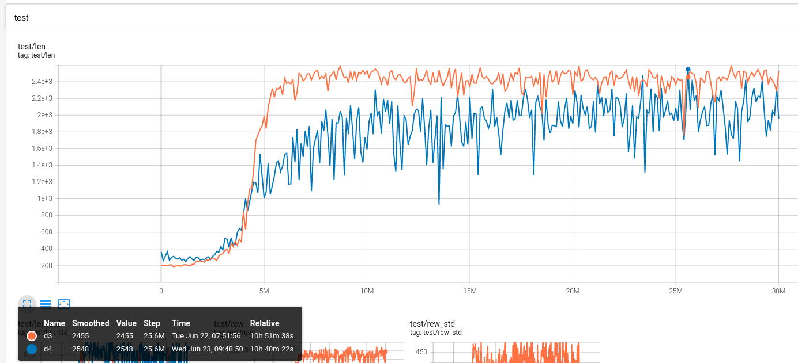
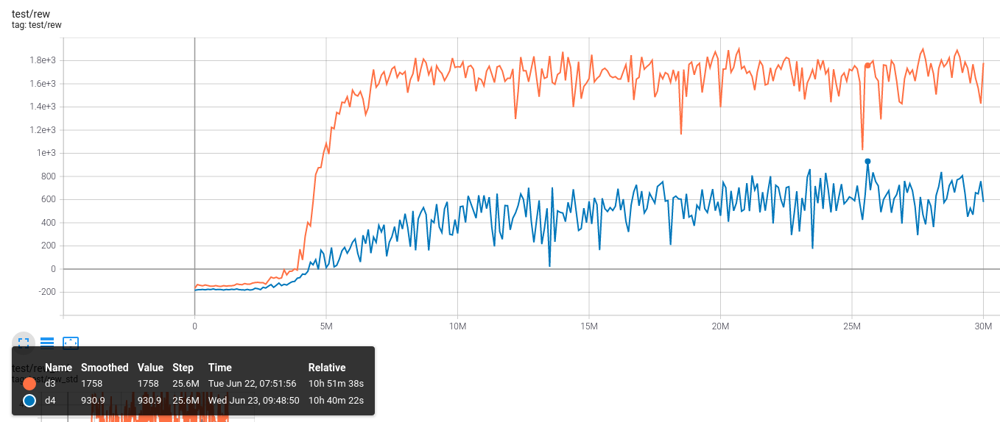
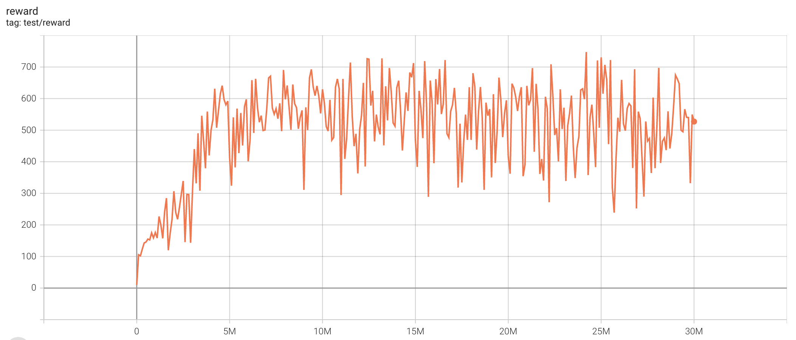
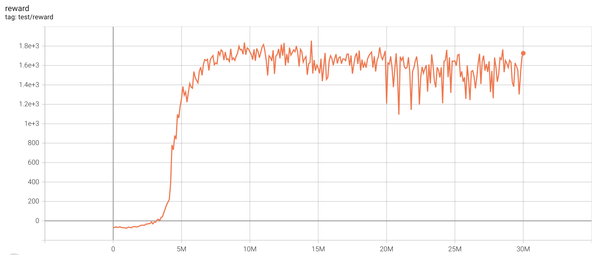
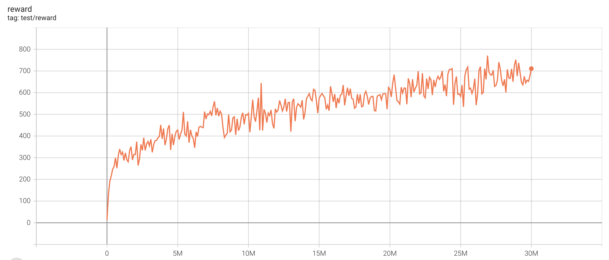
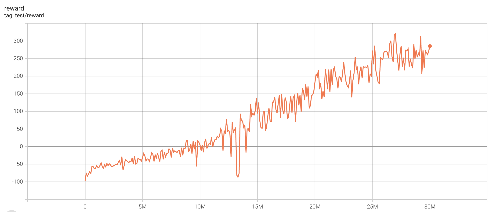
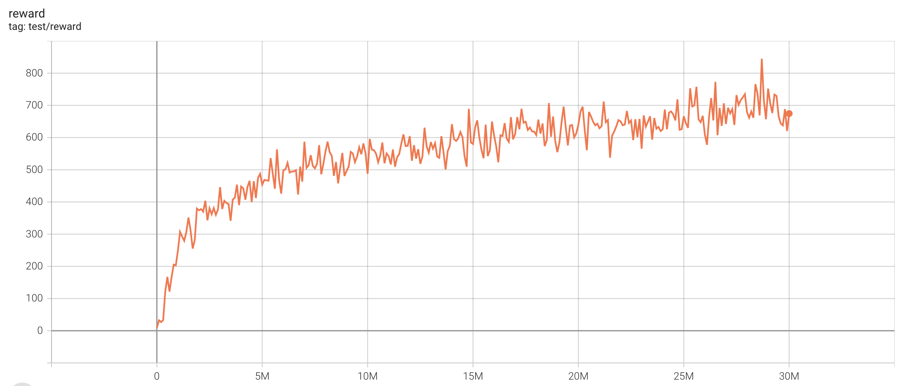
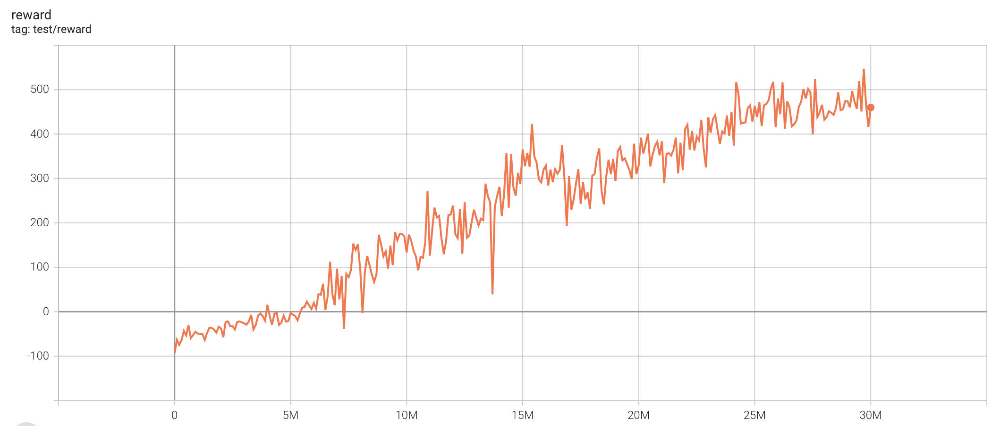

# ViZDoom

[ViZDoom](https://github.com/mwydmuch/ViZDoom) is a popular RL env for a famous first-person shooting game Doom. Here we provide some results and intuitions for this scenario.

## EnvPool

We highly recommend using envpool to run the following experiments. To install, in a linux machine, type:

```bash
pip install envpool
```

After that, `make_vizdoom_env` will automatically switch to envpool's ViZDoom env. EnvPool's implementation is much faster (about 2\~3x faster for pure execution speed, 1.5x for overall RL training pipeline) than python vectorized env implementation.

For more information, please refer to EnvPool's [GitHub](https://github.com/sail-sg/envpool/) and [Docs](https://envpool.readthedocs.io/en/latest/api/vizdoom.html).

## Train

To train an agent:

```bash
python3 vizdoom_c51.py --task {D1_basic|D2_navigation|D3_battle|D4_battle2}
```

D1 (health gathering) should finish training (no death) in less than 500k env step (5 epochs);

D3 can reach 1600+ reward (75+ killcount in 5 minutes);

D4 can reach 700+ reward. Here is the result:

(episode length, the maximum length is 2625 because we use frameskip=4, that is 10500/4=2625)



(episode reward)



To evaluate an agent's performance:

```bash
python3 vizdoom_c51.py --test-num 100 --resume-path policy.pth --watch --task {D1_basic|D3_battle|D4_battle2}
```

To save `.lmp` files for recording:

```bash
python3 vizdoom_c51.py --save-lmp --test-num 100 --resume-path policy.pth --watch --task {D1_basic|D3_battle|D4_battle2}
```

it will store `lmp` file in `lmps/` directory. To watch these `lmp` files (for example, d3 lmp):

```bash
python3 replay.py maps/D3_battle.cfg episode_8_25.lmp
```

We provide two lmp files (d3 best and d4 best) under `results/c51`, you can use the following command to enjoy:

```bash
python3 replay.py maps/D3_battle.cfg results/c51/d3.lmp
python3 replay.py maps/D4_battle2.cfg results/c51/d4.lmp
```

## Maps

See [maps/README.md](maps/README.md)

## Reward

1. living reward is bad
2. combo-action is really important
3. negative reward for health and ammo2 is really helpful for d3/d4
4. only with positive reward for health is really helpful for d1
5. remove MOVE_BACKWARD may converge faster but the final performance may be lower

## Algorithms

The setting is exactly the same as Atari. You can definitely try more algorithms listed in Atari example.

### C51 (single run)

| task                        | best reward | reward curve                          | parameters                                                   |
| --------------------------- | ----------- | ------------------------------------- | ------------------------------------------------------------ |
| D2_navigation          | 747.52          |          | `python3 vizdoom_c51.py --task "D2_navigation"` |
| D3_battle              | 1855.29          |          | `python3 vizdoom_c51.py --task "D3_battle"` |

### PPO (single run)

| task                        | best reward | reward curve                          | parameters                                                   |
| --------------------------- | ----------- | ------------------------------------- | ------------------------------------------------------------ |
| D2_navigation          | 770.75          |          | `python3 vizdoom_ppo.py --task "D2_navigation"` |
| D3_battle              | 320.59          |          | `python3 vizdoom_ppo.py --task "D3_battle"` |

### PPO with ICM (single run)

| task                        | best reward | reward curve                          | parameters                                                   |
| --------------------------- | ----------- | ------------------------------------- | ------------------------------------------------------------ |
| D2_navigation          | 844.99          |          | `python3 vizdoom_ppo.py --task "D2_navigation" --icm-lr-scale 10` |
| D3_battle              | 547.08          |          | `python3 vizdoom_ppo.py --task "D3_battle" --icm-lr-scale 10` |
